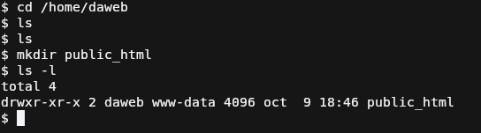

# Práctica 2.1: Instalación y configuración de un servidor web Nginx
## Introducción
En esta práctica vamos a instalar y configurar Nginx, además 
del correspondiente software de FTP para poder subir las webs 
al servidor, y también veremos como configurar HTTPS en Nginx.


##  Instalación de NGINX
En primer lugar, para instalar el paquete Nginx en Debian se debe de actualizar los repositorios (para cualquier paquete ciertamente), y después instalarlo, esto se logra mediantes los siguientes comandos:
```bash
sudo apt-get update
sudo apt-get install nginx
```
Tendría que salir algo parecido a lo de la siguiente captura, nos preguntará si queremos continuar (**se puede obviar usando el parámetro -y en el segundo comando anterior**), escribimos S y presionamos sobre Enter.


Una vez hecho esto solo queda comprobar el estado del servicio web, para realizar esto en Debian 12, se usará el siguiente comando:
```bash
sudo systemctl status nginx
```
Este comando se deberá ejecutar con sudo ya que así nos mostrarán los mensajes de logs de la aplicación para comprobar que todo vaya correctamente,
si todo salió bien, se deberá de mostrar algo como en la captura:


En caso de que algo haya ido mal lo mostrará en los logs el problema que hay para poder arreglarlo.
Como prueba final si accedemos al servidor por medio de su IP en un navegador web y se nos muestra la web por defecto de Nginx, tal y como en la siguiente captura.


### Configuración de un host en Nginx
### Creación del directorio del servidor
Para configurar un host separado de los demás lo recomendable es crear una carpeta donde poner los archivos por cada host, por lo que se creara una carpeta dentro del directorio `/var/www` que es la carpeta por defecto del servidor web, se darán los permisos necesarios y se cambiará el dueño de la carpeta para que no haya problemas de acceso.


El conjunto de comandos usado es:
```bash
sudo mkdir /var/www/daweb && sudo chown www-data:www-data /var/www/daweb && sudo chmod 755 /var/www/daweb
```

### Configuración del host en Nginx
Para configurar un host en Nginx primero debemos de localizar la carpeta donde se guardan la configuración de los hosts existentes, esta es `/etc/nginx/sites-available`. También existe otra ruta donde están los hosts activos en Nginx la cuál es `/etc/nginx/sites-enabled`, permitiendo tener configurado diferentes hosts y estar activos los que necesitemos.

Para configurar un host, debemos copiar el archivo por defecto y modificarlo, o copiar el siguiente bloque de código en un archivo con el nombre que desees, recomendable que sea el nombre del host:
```properties
server { 
        listen 80;
        listen [::]:80;
 
        server_name <hostname>;
 
        root <foldername>;      
        index index.html;
 
        location / {
                try_files $uri $uri/ =404;
        }
} 
```

El `<hostname>` es el nombre de host por el que se accederá a la web y el `<foldername` es la ruta al directorio que creamos en el subapartado anterior. Quedaría algo así un archivo de configuración básica:


Ahora para habilitar este sitio, debemos de poner este archivo dentro de `sites-enabled`, lo más común es crear un enlace simbólico desde el fichero en `sites-available` a `sites-enabled` tal y como se muestra en la siguiente captura:


Ahora solo queda reiniciar el servicio de Nginx usando el siguiente comando:
```bash
sudo systemctl restart nginx
```
### Añadir al archivo host la nueva URL
Para poder acceder a la web que acabamos de configurar se debe de acceder por medio de la url configurada en `hostname`, pero ocurre que por ahora no apunta a nuestro servidor o apunta a una web que no sabemos cuál es. Bien, lo normal sería usar un servidor DNS que resuelva el nombre y apunte al servidor pero como es un servidor de pruebas usaremos un fichero del sistema operativo que hace la función de "DNS" local.
Depende del sistema operativo, este estará en diferentes lugares:
* **Linux**: `/etc/hosts`
* **Window**: `C:\Windows\System32\drivers\etc\hosts`
* **MacOS**: `/private/etc/hosts`

Para modificarlo deberás de usar tu editor de texto favorito con permisos de administrador, entonces se nos mostrará un archivo con el siguiente formato (en Linux al menos):
```
<ip> <hostname>
<ip> <hostname>
<ip> <hostname>
...
```
En mi caso he puesto un comentario para mas claridad(simplemente separar), y ahi he puesto que en __**MI sistema**__ resuelva el nombre a esa IP.


### Probar web
Para probar el host, voy a crear un archivo de prueba muy básico y lo guardaré dentro de `/var/www/daweb` ya que es donde está la carpeta raíz del host configurado anteriormente


Solo quedaría acceder a la web en el navegador.


## Añadir cifrado (HTTPS)

Como ya sabemos, es muy importante el cifrado de los datos en la 
web ya que permite realizar operaciones con información sensible 
de forma segura. Una web para que esté cifrada debe de proporcionar 
un certificado SSL(ahora TLS) expedido por una autoridad certificadora válida.

En internet se suele oir la CA de Let's Encrypt ya que hacen certificados 
TLS totalmente gratuitos con la única pega de que duran 3 meses, pero esto 
requiere que el servidor sea accesible desde internet por lo que usaremos 
certificados autofirmados, los cuales el navegador indicará que no es segura 
la web, pero si encriptará los datos con este certificado.
### Generar certificado
Para generar el certificado, usaremos el software openssl, disponible en la mayoría de sistemas UNIX-Like en su gestor de paquetes. 
Para Debian 12, usarás:
```bash
sudo apt-get install openssl
```

Una vez hecho esto, se deberá de crear el certificado auto-firmado, para esto se ejecutará el siguiente comando: 
```bash
openssl req -x509 -newkey rsa:4096 -keyout <private_key_file> -out <certificate_file> -sha256 -days 365 --nodes
```
Este comando parece muy complicado pero vamos a explicarlo para que se entienda perfectamente:

* **req**: comando que indica a openssl que vas a iniciar una petición de firmado de certificado.
* **x509**: indica que usará la estructura de certificado X.509.
* **newkey**: indica que generará una clave usando el algoritmo indicado despues con `<algoritmo>:<bits>`.
* **keyout**: archivo donde se guardará la clave privada.
* **out**: archivo donde se guardará el certificado.
* **sha256**: indicamos que el certificado usará SHA-256 para calcular el hash.
* **days**: número de días de válidez del certificado.
* **nodes**: no encripta la clave privada, por lo que no nos pedirá contraseña para la clave. Lo usamos aquí para que
no de problemas con Nginx al momento de importarla en el host. **Recomendable usar el parámetro `noenc` ya que `nodes` está en desuso pero aun funciona.**


Después nos pediran que rellenemos una serie de datos, se 
rellenan conforme los pidan pero quiero hacer incapié en el 
apartado de **Common Name**, aquí es donde se escribirán los 
dominios y subdominios al que el certificado va dirigido. 
Para hacer un certificado rápido puedes dejar todos los campos 
vacíos menos el de **Common Name** y **Email Address**.


Ahora para tener el certificado en otra carpeta diferente, voy 
a mover el certificado y la clave a otra carpeta, mas específico 
a una que tiene Debian 12 y que almacena todos estos archivos:

* **Certificados**: /etc/ssl/certs
* **Clave privada**: /etc/ssl/private

### Configurar el host de Nginx para HTTPS
Para configurar el host, se deberá de modificar el host 
que ya se creó anteriormente, y lo que hay que hacer es que 
cuando un usuario se conecte al servidor por HTTP, el protocolo
sin cifrado, redirija automáticamente a HTTPS, esto es algo sencillo
por suerte, se hace de la siguiente forma:


Estas directivas son muy sencillas de entender pero por si acaso, 
las voy a explicar. La primera indica que escuchará en el puerto 80,
el por defecto del protocolo HTTP, la segunda indica el nombre del host, 
el que pusimos en el certificado, y el último indica que el host
devolverá a las peticiones el código 301(redireccionamiento) y redirigirá a la misma URL pero cambiando el protocolo por HTTPS.


Ahora para la configuración del SSL, si nos fijamos es muy parecida a la configuración por defecto menos por ciertos detalles, para empezar hemos hecho que no escuche por IPV6, tanto aquí como en la configuración de redireccionamiento, ya que no lo veo necesario, después hay un pequeño añadido en `listen`, que es la palabra `ssl` para poder habilitar el SSL. Para finalizar añadimos dos directivas nuevas, que son:

* ssl_certificate: ruta al certificado generado
* ssl_certificate_key: ruta a la clave privada del certificado

### Accedemos a la web


En la captura se demuestra que al acceder a la web, esta redirige al host HTTPS y se ve un candado con alerta, pero dice **riesgo de seguridad**. Esto se debe a que al usar un certificado firmado por uno mismo y no por una CA válida, para el navegador es un certificado inseguro aunque esté vigente. Simplemente buscamos el botón de Aceptar el riesgo y continuar y podemos acceder a la web.


Como se ve, se muestra la web tal y como la teníamos pero con el protocolo HTTPS.

## Configuración de servidor SFTP
La práctica indica que instalemos un servidor FTP, pero 
también es posible hacerlo directamente con SSH pero al 
igual que con FTP, hay que crear un usuario para subir los archivos.

### Creación del usuario


Para crear un usuario, se deberá de ejecutar el comando de la captura de pantalla, cuyos parámetros explicaré ahora mismo:

* **g**: indicamos cual será su grupo principal, en este caso será el grupo www-data ya que es el grupo por defecto que usa nginx.
* **m**: indicamos que se creará la carpeta del usuario.

Para terminar se pasa el nombre del usuario a crear y ejecutamos el comando, tras esto se deberá de asignar una contraseña al usuario con 
el comando `passwd`, que es interactivo.

Ahora para que el servicio ssh encuentre el nuevo usuario, se deberá de reiniciar usando el siguiente comando:
```bash
sudo systemctl restart sshd
```


Para comprobar que podemos conectarnos, usaremos Filezilla para ello, rellenamos con los datos para conectarnos en la captura podemos ver que estamos en la carpeta del nuevo usuario creado.

### Cambio de la raíz del servidor
Para que podamos subir nuevos archivo al servidor web, no a la máquina 
debemos de poder acceder al directorio `/var/www/daweb`. Esto se puede hacer 
de varias formas, entre ellas darle permisos al usuario creado en el directorio o 
la que nosotros vamos a hacer, crear una carpeta dentro de la carpeta home del 
nuevo usuario.



El nombre de la carpeta que debemos de crear puede ser cualquiera, pero por defecto se suele 
usar `public_html` por lo que ese será el nombre de este. Si nos fijamos el grupo que tiene acceso 
a la carpeta es `www-data`, gracias a que el usuario daweb su grupo principal es el mismo.


El siguiente paso es abrir el archivo de configuración del host, y buscar la directiva `root` para sustituir la antigua ruta
por la ruta hacia la carpeta que hemos creado ahora mismo. Guardamos los cambios y reiniciamos el servidor con el siguiente comando
```bash
sudo systemctl restart nginx
```

### Prueba de subida


Se crea un nuevo archivo de pruebas para comprobar que la subida a esta carpeta funciona y que cuando coloquemos el archivo dentro de `public_html`,
los cambios se vean reflejados por los usuarios.


Nos conectamos de nuevo al servidor usando un cliente FTP, en mi caso Filezilla pero esta vez cambiamos el usuario `anes` por `daweb` y ponemos
su respectiva contraseña. Tras esto se sube dentro de la carpeta `public_html` el archivo html creado.


La prueba de que todo ha salido correcto se ve en la captura, al acceder a la misma ruta vemos que en vez de mostrar el antiguo archivo, muestra el nuevo que se ha subido por medio de SFTP.

## Referencias
* [Documentación de Nginx](http://nginx.org/en/docs/varindex.html)
* [Material del profesor](https://raul-profesor.github.io/Despliegue/P1.1/)