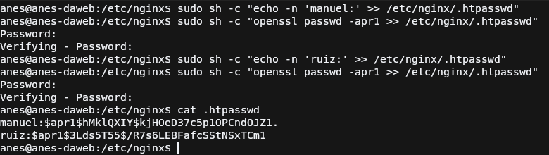
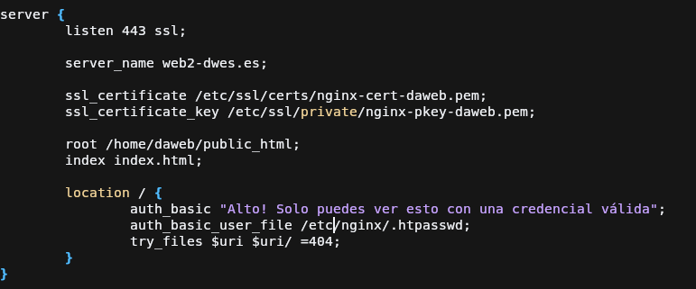
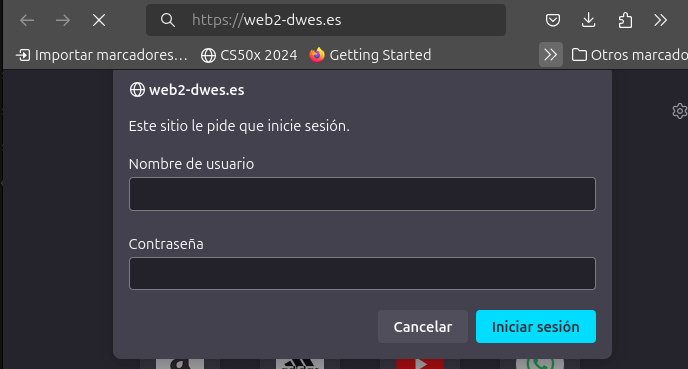
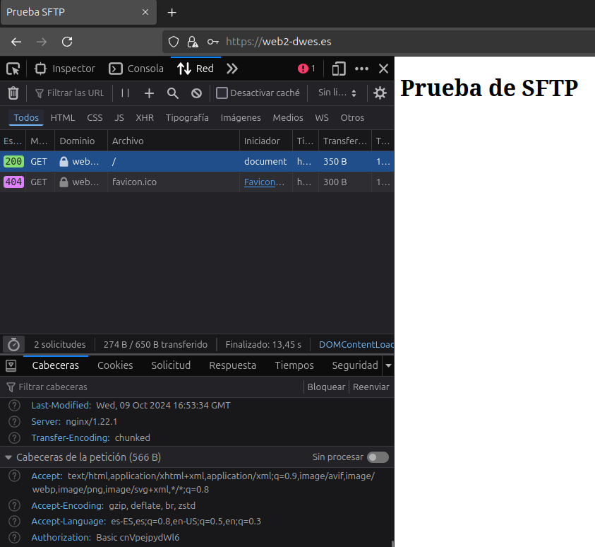

# Práctica 2.2: Autenticación en un servidor web Nginx
## Introducción
En esta práctica se va a implementar autenticación en Nginx, esta será la autenticación `basic` 
la cuaĺ es definida en el estándar de HTTP, aunque sirve para algunas pruebas no es un método seguro
actual para la autenticación de usuarios ya que el usuario.

Para hacer esto necesitaremos el paquete openssl para poder crear las contraseñas, generalmente viene 
instalado pero en caso de que no, ejecuta el siguiente comando en tu máquina Debian 12:

```bash
sudo apt-get install openssl # nota: mejorar el comando para que detecte la instalación y si no la detecta instalarlo
```
## Añadir autenticación basic a Nginx
### Generar usuarios y contraseñas

Para poder usar la autenticación "basic" de HTTP, se debe de generar un usuario y configurarlo dentro del servidor, en
este apartado cubrimos la parte de generar un usuario.

El primer comando que se ejecuta es para mostrar un mensaje en terminal que es `echo` pero podemos redirigir la salida del comando usando
`>>`, esto permite hacer lo que se ha comentado pero sin aplastar todo el contenido del archivo, añadiendolo al final de este. El archivo
como se ve en el comando es `.htpasswd` que se guardará dentro de `/etc/nginx`. 

El segundo comando usado lo que hace es usar el software `openssl` para generar el hash de la contraseña que elijamos, el parámetro `apr1`
indica que el hash generado usará el algoritmo MD5 con la variante de apache. Nos preguntará por la contraseña de querramos usar.

Si nos fijamos el comando está envuelto con otro que es `sh` 
debido a que necesitamos permisos de administrador para guardar o crear el archivo en ese directorio.

### Configurar el archivo de host de Nginx


Para poder proteger la web, se deberá de añadir dos directivas al archivo de host, estas directivas no se añaden al bloque `server{...}` sino
al bloque `location{...}` para así poder tener en una misma web diferentes rutas las cuales unas estén disponible a todos los usuarios y otras
a los usuarios que permitamos nosotros por medio del archivo que hemos creado.

Como se ve en la captura necesitamos añadir las siguientes directivas:  

* auth_basic: con el mensaje que mostrará al usuario si ha pasado las credenciales necesarias.
* auth_basic_user_file: ruta al archivo que hemos creado anteriormente. Puede estar donde sea

### Probamos web


Al acceder a la ruta nos saltará un formulario del navegador donde nos pide que introduzcamos los credenciales para acceder, estos credenciales si todo sale como tiene que salir, son los dos creados anteriormente, `manuel` y `ruiz` cuya contraseña es el mismo usuario.


Aquí se puede comprobar que tras introducir los credenciales correctos podemos acceder a la web que ya teníamos. Si nos fijamos en las cabeceras enviadas hay una muy importante que es `Authorization` donde indica que el tipo de autenticación es `basic` junto al usuario y contraseña codificados en base64.

## Referencias
* [MDN](https://developer.mozilla.org/en-US/docs/Web/HTTP/Authentication)
* [Material del profesor](https://raul-profesor.github.io/DEAW/P1.2/)