# Práctica 2.2: Autenticación en un servidor web Nginx
## Introducción 
En esta práctica se va a implementar autenticación en Nginx, esta será la autenticación `basic` 
la cuaĺ es definida en el estándar de HTTP, aunque sirve para algunas pruebas no es un método recomendado
actualmente para la autenticación de usuarios ya que existen otras mucho más seguras y completas.

Para hacer esto necesitaremos el paquete openssl para poder crear las contraseñas, generalmente viene 
instalado pero en caso de que no, ejecuta el siguiente comando en tu máquina Debian 12, comprobará si 
está instalado y en caso de que no, lo instalará automáticamente:

```bash
openssl -h 2>/dev/null && echo "OpenSSL está instalado en el sistema" || (sudo apt-get update && sudo apt-get install -y openssl)
```
## Añadir autenticación basic a Nginx
### Generar usuarios y contraseñas

Para poder usar la autenticación "basic" de HTTP se debe de generar un usuario, contraseña y guardarlo en un archivo para que mas tarde sea
referenciado por algún host configurado en Nginx y poder proteger las rutas haciéndolas accesibles únicamente con los usuarios del archivo. Dicho archivo deberá de tener la siguiente sintáxis:
```
<usuario>:<hash-contraseña>
<usuario>:<hash-contraseña>
<usuario>:<hash-contraseña>
...
```

El primer comando que se ejecuta es para mostrar un mensaje con el nombre de usuario en terminal que es `echo` pero podemos redirigir la salida 
del comando usando el operador de redirección `>>`, esto permite hacer lo que se ha comentado pero sin aplastar todo el contenido del archivo, 
añadiendolo al final de este. El archivo como se ve en el comando es `.htpasswd` que se guardará dentro de `/etc/nginx`. 

El segundo comando usado lo que hace es usar el software `openssl` para generar el hash de la contraseña que elijamos, el parámetro `apr1`
indica que el hash generado usará el algoritmo MD5 con la variante de apache. Nos preguntará por la contraseña de querramos hashear y escribirá 
en la salida por defecto la contraseña hasheada pero redirigimos la salida al archivo `.htpasswd`;

Si nos fijamos los comandos están envuelto con otro que es `sh` 
debido a que necesitamos permisos de administrador para guardar o crear el archivo en ese directorio usando el operador de redirección.

El uso de estos dos comandos reiteradas veces permitirá crear los usuarios. Si necesitas esto en otro archivo diferente simplemente cambia el
nombre del archivo al que rediriges la salida y ya tendrás otro archivo con diferentes usuarios.

### Configurar el archivo de host de Nginx


Para poder proteger la web, se deberá de añadir dos directivas al archivo de host, estas directivas no se añaden al bloque `server{...}` sino
al bloque `location{...}` para así poder tener en una misma web diferentes rutas las cuales unas estén disponible a todos los usuarios y otras
a los usuarios que permitamos nosotros por medio del archivo que hemos creado.
Como se ve en la captura necesitamos añadir las siguientes directivas:  

* auth_basic: con el mensaje que enviará al usuario si ha cancelado el inicio de sesión.
* auth_basic_user_file: ruta al archivo que hemos creado anteriormente. Puede estar en donde creas conveniente.

### Probamos web
#### Inicio de sesión


Al acceder a la ruta nos saltará un formulario del navegador donde nos pide que introduzcamos los credenciales para acceder, 
estos credenciales si todo sale como tiene que salir, son los dos creados anteriormente, `manuel` y `ruiz` cuya contraseña 
es el mismo usuario.

#### Inicio de sesión exitoso

Aquí se puede comprobar que tras introducir los credenciales correctos podemos acceder a la web que ya teníamos. Si nos 
fijamos en las cabeceras enviadas hay una muy importante que es `Authorization` donde indica que el tipo de autenticación 
es `basic` junto al usuario y contraseña codificados en base64.

#### Inicio de sesión cancelado
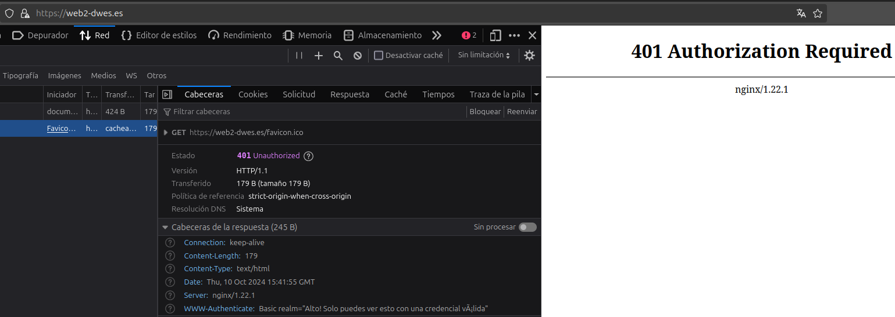
Si cancelamos el inicio de sesión, la web mostrará el error 401 del estándar HTTP, este se muestra cuando un usuario intenta 
acceder a un recurso protegido en un servidor sin introducir unas credenciales válidas. En la captura se puede ver en las 
cabeceras de respuesta la cabecera `WWW-Authenticate` que indica de nuevo el tipo de autenticación y una palabra clave 
`realm` que contiene el mensaje que introducimos en el apartado anterior.

## Autenticación en una ruta específica del host
Antes comentábamos que podíamos proteger diferentes rutas del host en vez de todas a la vez, esto se hace creando 
diferentes bloques `location{...}` que apunten a diferentes rutas del servidor y añadiendo la autorización a las que veamos conveniente. Aquí un ejemplo:

### Configuración del archivo de host
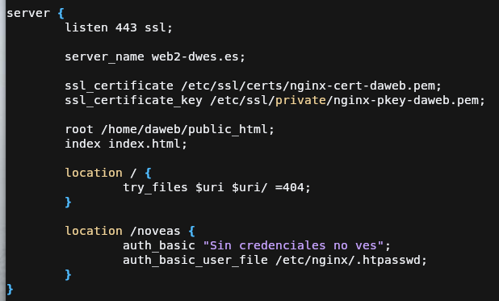

Como se ve en la captura tenemos otra ruta en el servidor que es `/noveas`, esta ruta será que protejamos con la autenticación por lo 
que vamos a aprovechar la configuración, y mover la configuración de la autenticación únicamente hacia el nuevo `location /noveas {...}`.

Si nos fijamos la directiva `try_files` solo aparece una sola vez en vez de en los 2 bloques location, esto es porque en el primer 
bloque apuntamos a todos los directorios del host, y el segundo location es un subdirectorio del host por lo que no es necesario usar
esa directiva, podría incluso fallar el servidor.

Tras esto se reinicia nginx usando:
```bash
sudo systemctl restart nginx
```

### Subida de web a la nueva ruta

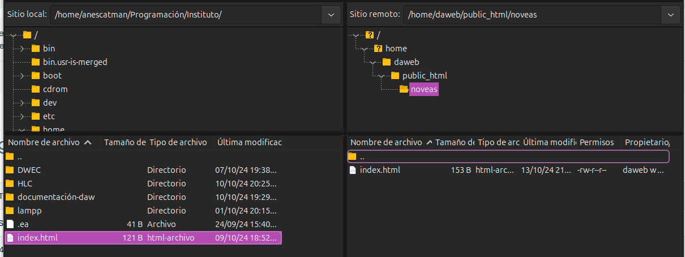

Para probar la nueva configuración vamos a crear un archivo de prueba más que solo será accesible con contraseña, entonces para subirlo 
usaré el cliente FTP Filezilla, iniciamos sesión en el servidor que configuramos en la anterior práctica y dentro de la carpeta 
correspondiente creamos el directorio `noveas`, y dentro metemos el archivo de nuestro sistema.

### Prueba de acceso a las rutas definidas

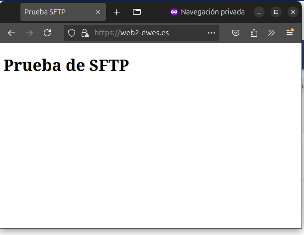

Si intentamos acceder a la ruta principal, veremos que no tenemos la autenticación como antes teníamos.

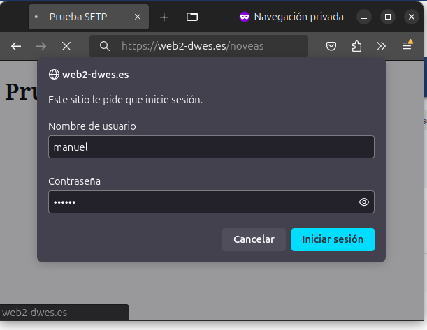

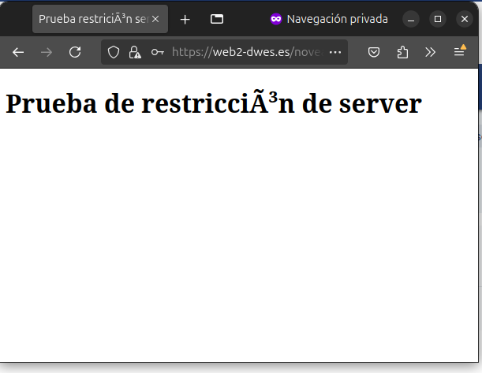

Al intentar acceder a la ruta `noveas` si que nos pedirán autenticación y al pasarles las credenciales correctas podemos ver que 
nos permiten acceder al archivo index.html que subimos.

## Restricción de acceso por IP

Nginx nos permite también rechazar las peticiones de clientes con cierta IP, útil por ejemplo en una red local donde los equipos tengan todos una IP fija y así permitir únicamente a ciertos equipos acceder a partes de la red.

### Configuración del archivo host

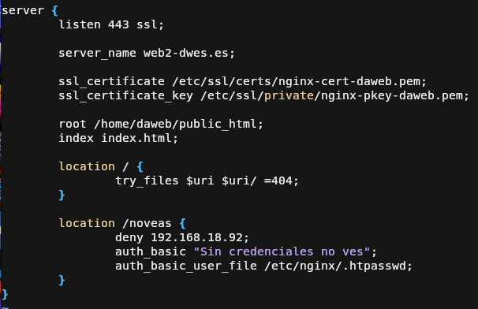

Para poder denegar el acceso a una IP debemos de usar la directiva `deny` la cuál tiene 2 valores posibles:

* all: deniega el acceso a todas las IP.
* &lt;IP&gt;: Deniega el acceso a la ip que indiquemos.

En mi caso para hacer la prueba voy a denegar el acceso a mi máquina anfitriona para probar que deniega la conexión, por lo que coloco 
la ip correspondiente y guardamos la configuración.

Tras esto se reinicia Nginx con:
```bash
sudo systemctl restart nginx
```

### Probamos la restricción

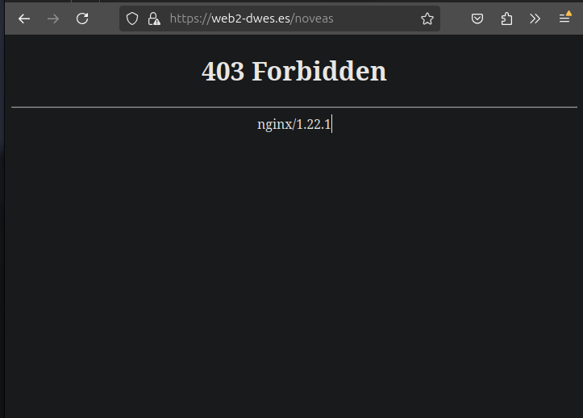

Al intentar acceder a la ruta `noveas` con la nueva configuración podemos ver que nos muestra un error 403.

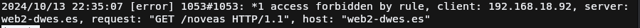.

Los logs que se ven en la captura indica que el acceso a la ruta ha sido denegado ya que el cliente coincide con la IP.

## Restricción por IP y por usuario simultánea
Nginx nos permite restringir el acceso tanto por IP y cuenta de usuario a la vez, permitiendo proteger recursos de accesos no 
autorizados, esto se logra mediante la palabra clave `satisfy`, que permite los valores:

* any: Para que no devuelva 403, debe cumplir al menos la directiva de `auth` (no especifico la de basic ya que pueden haber de 
diferentes tipos) o la directiva de restricción por IP.
* all: Esta es parecida a la anterior solo que obliga a cumplir todas las directivas.

### Configuración del archivo host
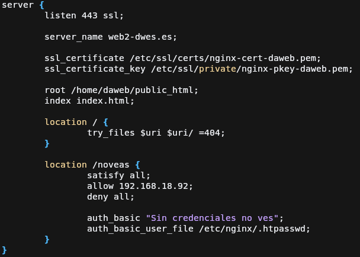

En la captura se muestra una configuración que obliga a que el usuario se tenga que autenticar con una credencial válida y 
que su IP coincida con `192.168.18.92` gracias a la directiva `allow`. Y si no coincide con esta, se rechazará la conexión 
devolviendo el código 403 ya que hemos puesto la directiva `deny all` para que rechace cualquier conexión.

Es muy importante el orden ya que si colocamos `deny all` antes de la directiva `allow` se rechazarán todas la conexiones ya 
que las restricciones se aplican por orden de aparición en el bloque de configuración

### Probamos acceso

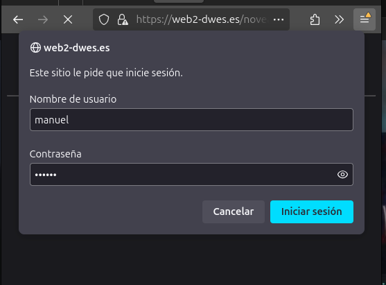

Como podemos comprobar nos deja acceder ya que tenemos que la única IP que puede acceder al recurso la tiene la máquina anfitriona 
pero necesitamos iniciar sesión ya que también tenemos configurada la autenticación básica.

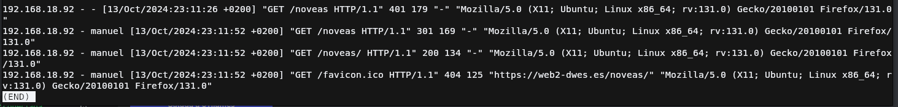

Aquí podemos ver los logs de acceso y como en ellos se ve el que el usuario Manuel ha sido el que ha iniciado sesión

## Cuestiones
A continuación se va a responder las cuestiones que se proponen en la práctica

!!! question "Cuestión 1"
    Supongamos que yo soy el cliente con la IP 172.1.10.15 e intento acceder al directorio web_muy_guay de mi sitio web, equivocándome al poner el usuario y contraseña. ¿Podré acceder?¿Por qué?
    ```nginx
    location /web_muy_guay {
        #...
        satisfy all;    
        deny  172.1.10.6;
        allow 172.1.10.15;
        allow 172.1.3.14;
        deny  all;
        auth_basic "Cuestión final 1";
        auth_basic_user_file conf/htpasswd;
    }
    ```
    No podrá acceder debido a la directiva `satisfy all` ya que aunque su IP sean de las permitidas, no cumple con la autenticación básica ya que la directiva nombrada obliga a cumplir todas las condiciones.

!!! question "Cuestión 2"
    Supongamos que yo soy el cliente con la IP 172.1.10.15 e intento acceder al directorio web_muy_guay de mi sitio web, equivocándome al poner el usuario y contraseña. ¿Podré acceder?¿Por qué?
    ```nginx
    location /web_muy_guay {
        #...
        satisfy all;    
        deny  all;
        deny  172.1.10.6;
        allow 172.1.10.15;
        allow 172.1.3.14;

        auth_basic "Cuestión final 2: The revenge";
        auth_basic_user_file conf/htpasswd;
    }
    ```
    Para empezar no podrá acceder al inicio de sesión por culpa de la directiva `deny all` ya que al ir antes que todas, 
    deniegan todas las peticiones al en `web_muy_guay` aunque después la permita. Como se nombró en la práctica, las restricciones
    se aplican por orden de aparición.

!!! question "Cuestión 3"
    Supongamos que yo soy el cliente con la IP 172.1.10.15 e intento acceder al directorio web_muy_guay de mi sitio web, introduciendo correctamente usuario y contraseña. ¿Podré acceder?¿Por qué?
    ```nginx
    location /web_muy_guay {
        #...
        satisfy any;    
        deny  172.1.10.6;
        deny 172.1.10.15;
        allow 172.1.3.14;

        auth_basic "Cuestión final 3: The final combat";
        auth_basic_user_file conf/htpasswd;
    }
    ```
    El cliente aunque tenga denegada la IP, al estar la directiva `satisfy any` va a permitir entrar a la web solo si pasa las credenciales 
    correctas ya que la directiva permite que pueda acceder a la web si cumple algunas de las directivas.

!!! question "Cuestión 4"
    A lo mejor no sabéis que tengo una web para documentar todas mis excursiones espaciales con Jeff, es esta: [Jeff Bezos y yo](https://freewebsitetemplates.com/preview/space-science/index.html)

    Supongamos que quiero restringir el acceso al directorio de [proyectos](https://freewebsitetemplates.com/preview/space-science/projects.html) porque es muy secreto, eso quiere decir añadir autenticación básica a la URL:Proyectos

    Completa la configuración para conseguirlo:
    ```nginx
    server {
        listen 80;
        listen [::]:80;
        root /var/www/freewebsitetemplates.com/preview/space-science;
        index index.html index.htm index.nginx-debian.html;
        server_name freewebsitetemplates.com www.freewebsitetemplates.com;
        location {
            try_files $uri $uri/ =404;
        }
        # Mi aporte a la configuración
        location ~* /projects.html {
            auth_basic  "Estos son proyectos secretísimos con Bezos y yo, tu no entras aquí.";
            auth_basic_user_file /etc/nginx/.bezosxme;
        }
    }
    ```

## Referencias
* [MDN](https://developer.mozilla.org/en-US/docs/Web/HTTP/Authentication)
* [Material del profesor](https://raul-profesor.github.io/DEAW/P1.2/)
* [Documentación de Nginx](http://nginx.org/en/docs/http/ngx_http_core_module.html#location)