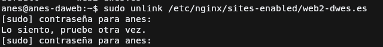
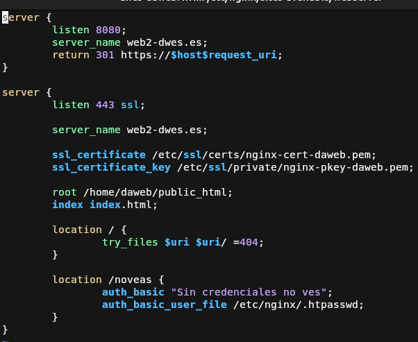
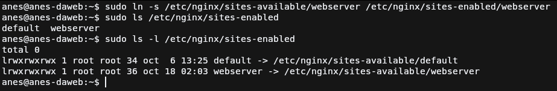
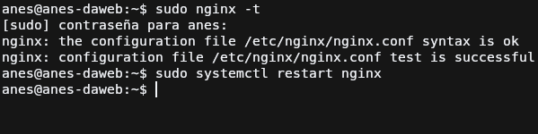
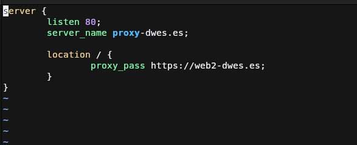
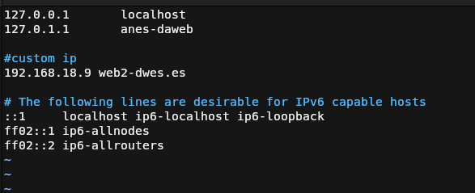
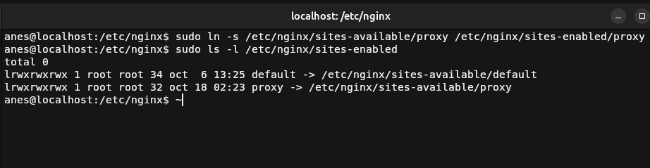
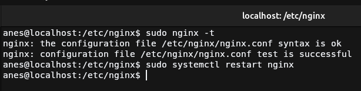
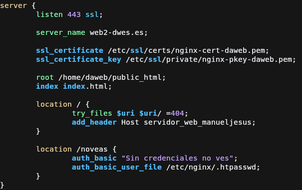
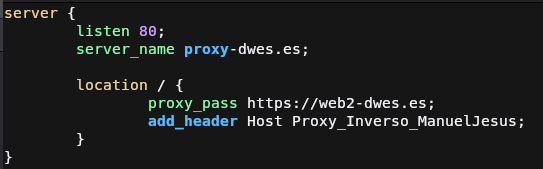

# Práctica 2.3: Proxy inverso con Nginx
## Introducción

Para configurar un servidor proxy, en esta práctica vamos a clonar la máquina virtual que teníamos, indicando previamente que genere una MAC para que al momento de obtener una IP no nos provoque ningún conflicto, para que nos entendamos en la práctica tendremos la máquina del `servidor web` que contendrá la página web que queremos mostrar, y la máquina del `proxy` que se encargará de dirigir la petición al servidor y de devolver la respuesta de este al cliente.

## Configuración del servidor web

Para no tocar lo que ya tenemos funcionando, vamos a trabajar en una copia del archivo de configuración del servidor web, 
para empezar debemos de borrar el enlace simbólico hacia la configuración de la carpeta `sites-enabled`. Con esto, desactivaremos
el host de la anterior práctica.

Ahora copiamos el archivo de configuración con el nuevo nombre que será el cuál vamos a modificar durante la práctica

Cambiamos el puerto de la configuración del host sin el cifrado, ya que no nos sirve ya este server para lo que queremos hacer ahora.

Habilitamos el sitio nuevo creando el enlace simbólico al `sites-enabled`.

Comprobamos la configuración y reiniciamos String

## Configuración del proxy inverso

Volvemos desactivar la web activa del servidor proxy ya que aquí tendríamos la misma configuración que en la práctica anterior.

Creamos un archivo nuevo de configuración ya que no nos hace falta rescatar nada de la antigua, en mi caso se llama `proxy` y se hace la configuración básica con `listen`, `server_name` y la directiva importante, `proxy_pass`. 
Esta directiva lo que hará es pasar la petición a la URL que se le indique para que la resuelva esta, y el proxy esperará a que termine para devolversela al cliente.

Para que el proxy encuentre la web que tenemos funcionando en el servidor, debemos
de añadir en su archivo de hosts localizado en `/etc/hosts` la ip del servidor y
el dominio que le hemos configurado anteriormente.

Activamos el proxy haciendo un enlace simbólico a `sites enabled` del servidor del proxy.

Se comprueba que la configuración es correcta usando el comando `sudo nginx -t ` y después se reincia el servidor web.

## Demostración del servidor proxy

Para comprobar que funciona correctamente nos dirigimos a la URL del proxy y podremos comprobar como nos muestra la página configurada en la otra máquina virtual sin que cambie la URL en el navegador.

## Modificar respuesta por medio del proxy

Para demostrar que desde el proxy podemos modificar la respuesta enviada por el
servidor web, vamos a añadir una cabecera a esta. Esto se hará mediante la directiva
`add_header <nombre_cabecera> <valor_cabecera>`. Esta cabecera puede estar dentro del bloque `server{...}`, `location{...}` o `http{...}` pero nosotros la pondremos dentro de location.

### Configuración del servidor web

También pondremos la directiva dentro del servidor web ya que queremos ver como 
aparece tanto las cabeceras del servidor como del proxy, en este caso añadiremos la cabecera Host con el valor que se muestra en captura.

Ahora hacemos lo mismo pero en el proxy y cambiando el valor de la cabecera.

### Demostración