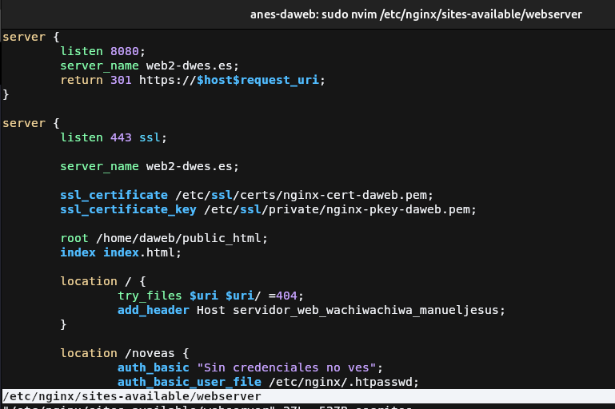
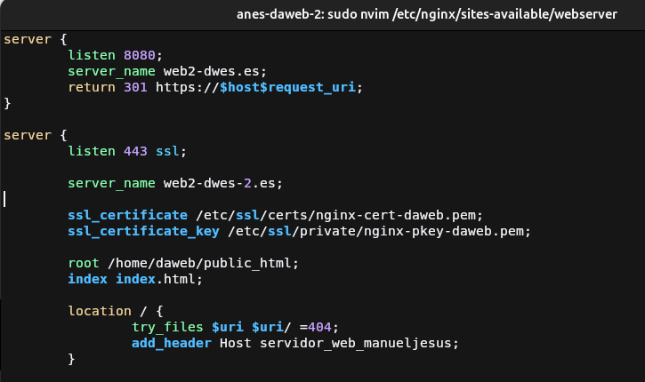
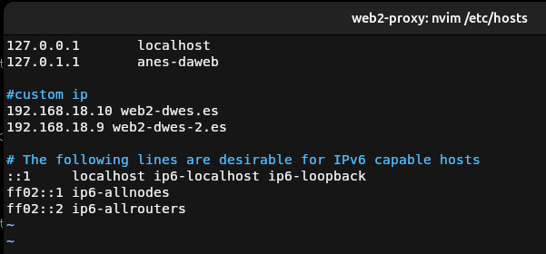
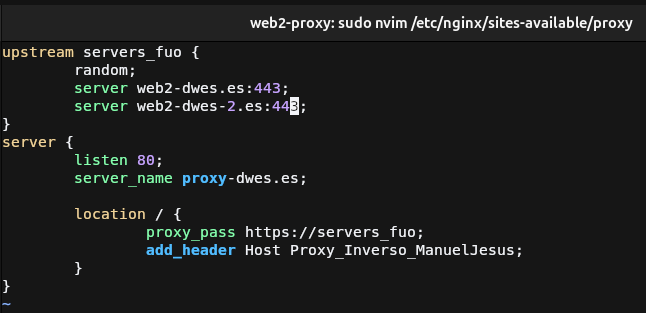
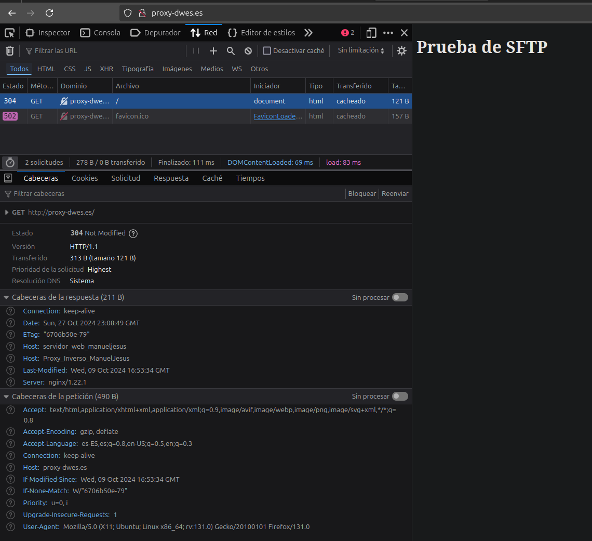
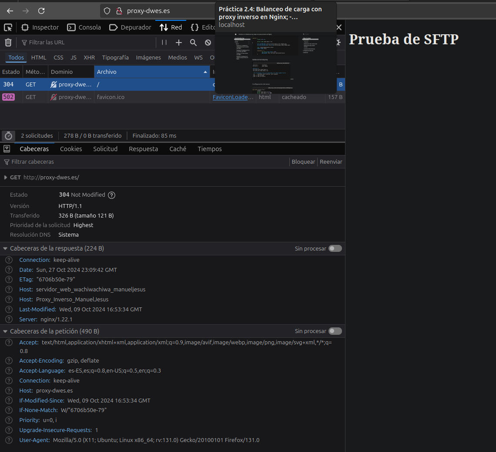
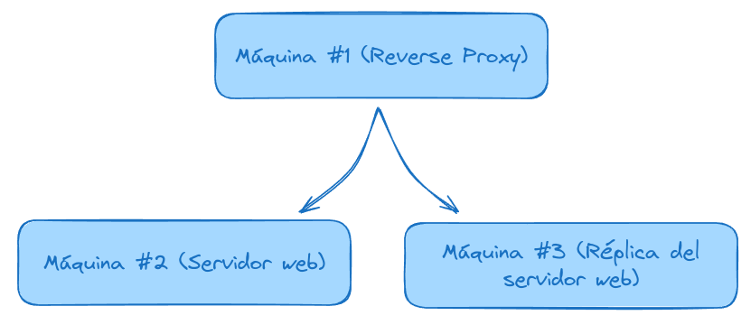

# Práctica 2.4: Balanceo de carga con proxy inverso en Nginx
## Introducción
### Clonación


Para comenzar esta práctica debemos de clonar la máquina virtual del servidor web, ya que necesitaremos una 
replica del servidor para que la práctica sea lo más fiel a la realidad posible.

Un balanceo de carga tiene  como objetivo repartir la carga del tráfico web entre servidores réplica para 
así agilizar el tráfico y que gane robustez ya que en caso de que caiga una réplica, siempre habrá otra 
proporcionando servicio.

### Modificación del servidor web



Este servidor no es necesario hacer ningún cambio pero en mi caso le voy a modificar la cabecera para que sea
diferente a la de la práctica anterior.

### Modificación del servidor clonado



Para que no haga conflicto los nombres de dominio deberemos de cambiar este en algún servidor, en mi caso será
el clonado para dejar el otro casi como en la práctica anterior. Simplemente a la directiva `server_name` se le 
cambia por la nueva dirección y se guarda.

Para finalizar reiniciamos Nginx con
```bash
sudo systemctl restart nginx
```

### Cambio de host del proxy


Ahora en el servidor del proxy debemos añadir la nueva entrada con el nuevo dominio para que Nginx lo detecte.

Para finalizar reiniciamos Nginx con
```bash
sudo systemctl restart nginx
```

## Configuración del proxy



Ahora viene lo importante, para que Nginx actue como un balanceador de carga debemos de agrupar los servidores a
los que Nginx enviará las peticiones, esto es posible mediante el bloque `upstream <nombre-grupo> {...}`. En este 
bloque es donde se añadirán los servidores a los que Nginx redirigirá las peticiones. Se hace mediante la directiva
`server <hostname|ip>:<puerto>` como se ve en la captura de pantalla y podemos comprobar que tenemos también la 
directiva `random`, que se usa para que rediriga la peticion a un servidor aleatorio de los añadidos en el bloque.

El último cambio a realizar es cambiar la directiva `proxy_pass` y cambiar la dirección al nombre elegido en el bloque 
`upstream`.

Para finalizar reiniciamos Nginx con
```bash
sudo systemctl restart nginx
```

## Demostración 



Desactivamos con `sudo systemctl stop nginx` el servidor 1 (el origen) para comprobar que envía la petición al servidor clonado 
ya que la cabecera que envía pertenece a este servidor



Desactivamos con `sudo systemctl stop nginx` el servidor 2 (el clonado) para comprobar que envía la petición al servidor 
web de origen al que le pusismos de cabecera Host `servidor_web_wachiwachiwa_manueljesus`.

## Cuestiones
### Cuestión 1
!!! question "Enunciado"
    Busca información de qué otros métodos de balanceo se pueden aplicar con Nginx y describe al menos 3 de ellos.
Los métodos de balanceo que he encontrado son: 

* `least_conn`: Este método de balanceo distribuirá la carga de forma que las nuevas peticiones irán siempre 
dirigidas a los servidores con menos conexiones activas.
* `ip_hash`: Este método de balanceo como dice su nombre, hace un hash de los 3 primeros octetos de la IPV4 o la
IPV6 completa del cliente y según la IP, la dirige a un servidor. Este servidor será siempre el que resuelva las
peticiones del mismo cliente a no ser que no esté disponible.
* `least_time`: Este método distribuye la carga tomando en cuenta el número de conexiones activas y además el tiempo
de respuesta del servidor, priorizando los que menos conexiones y tiempo de respuesta tengan.

### Cuestión 2
!!! question "Enunciado"
    Si quiero añadir 2 servidores web más al balanceo de carga, describe detalladamente qué configuración habría que añadir y dónde.

Si contamos que el servidor que añadimos ya está configurado previamente ya que sería una réplica del servidor 
al que queremos dar mas robustez o escalabilidad, únicamente habría que tocar el archivo de configuración del 
proxy y en el bloque `upstream` correspondiente añadir dos nuevas directivas:
```nginx
upstream servicio-reloco {
    ...;
    server <host_servidor_1>:<puerto_servidor_1>;
    server <host_servidor_2>:<puerto_servidor_2>;
}
```

### Cuestión 3
!!! question "Enunciado"
    Describe todos los pasos que deberíamos seguir y configurar para realizar el balanceo de carga con una de las webs de prácticas anteriores.
    
    Indicad la configuración de todas las máquinas (webservers, proxy...) y de sus servicios

Para realizar un balanceo de carga utilizando una web de las prácticas anteriores se deberá primeramente de 
preparar 3 máquinas virtuales mínimo con NGINX.


La primera máquina es la que hará de proxy la cual redirigirá las peticiones a las máquina que mejor venga en ese 
momento, empecemos configurándolas en orden.

#### Configuración del servidor web

---
Debemos de crear un archivo de configuración en el directorio `/etc/nginx/sits-available` y que en mi caso 
se llamará `webchuli` y su contenido será el siguiente:

```nginx title="/etc/nginx/sites-available/webchuli"
server {
    listen 80;
    server_name web-chuli-rpl1.es;

    root /home/webchuli/public_html;
    index index.html;

    location / {
        try_files $uri $uri/ =404;
    }
}
```

Tras crear este archivo, se deberá de crear el respectivo enlace simbólico blando en el directorio `/etc/nginx/sites-enabled` con el siguiente comando:
```bash 
sudo ln -s /etc/nginx/sites-available/webchuli /etc/nginx/sites-enabled/
```
Después reiniciar el servicio con el comando: 
```bash
sudo systemctl restart nginx
```

#### Configuración del servidor réplica

---
En la configuración de la replica, al ser como dice su nombre, una réplica del servidor web ya estarían 
realizados los pasos anteriores solo faltaría cambiar el server_name para que no haga conflicto con el
`server_name` de la máquina original.

```nginx title="/etc/nginx/sites-available/webchuli"
server {
    listen 80;
    server_name web-chuli-rpl2.es;

    root /home/webchuli/public_html;
    index index.html;

    location / {
        try_files $uri $uri/ =404;
    }
}
```

#### Configuración del proxy

---
Para configurar la máquina NGINX como un proxy inverso, lo haremos tal y como se ha descrito en toda la práctica.

Primero debemos de crear un bloque `upstream` en el que definiremos los servidores que hemos configurado anteriormente 
y el método de balanceo de carga. El elegido será `least_time` que tal como se explicó anteriormente redirigirá las 
peticiones al servidor con menor latencia y con menor carga de trabajo.

Tras esto configuramos el servidor proxy, que funcionará bajo la URL de `web-muy-chuli.es` o `www.web-muy-chuli.es` 
en y redireccionará las peticiones al grupo de servidores `web_chuli` definidos anteriormente gracias a la directiva
`proxy_pass`.
```nginx title="/etc/nginx/sites-available/webchuli-proxy"
upstream web_chuli {
    least_time;
    server web-chuli-rpl1.es:80;
    server web-chuli-rpl2.es:80;
}
server {
    listen 80;
    server_name web-muy-chuli.es www.web-muy-chuli.es;

    location / {
        proxy_pass http://web_chuli;
    }
}
```

Por último, ya que no usamos ningún DNS para resolver los nombres, debemos de añadir al archivo 
hosts del proxy las IP de las máquinas virtuales que usemos en los servidores web, quedando de la siguiente
forma siguiendo los nombres definidos:
```properties title="/etc/hosts"
<ip-servidor-web> web-chuli-rpl1.es
<ip-réplica-servidor-web> web-chuli-rpl2.es
```


Tras realizar las configuraciones indicadas, se deberá de crear el respectivo enlace simbólico blando en el directorio `/etc/nginx/sites-enabled` con el siguiente comando:
```bash 
sudo ln -s /etc/nginx/sites-available/webchuli-proxy /etc/nginx/sites-enabled/
```
Después reiniciar el servicio con el comando: 
```bash
sudo systemctl restart nginx
```
!!! warning 
    Se debe reiniciar después de añadir las IP al archivo hosts ya que nginx crashearía debido a que no encuentra los servidores indicados en el upstream


Una vez realizado esto ya solo queda añadir en el archivo hosts de tu sistema operativo la IP de tu proxy para probarlo tal y como se hizo al momento
de configurar la máquina proxy:

* **En windows:** 
```properties title="C:\Windows\System32\drivers\etc\hosts"
...
<ip-proxy> web-muy-chuli.es www.web-muy-chuli.es
```
* **En Linux o Mac:**
```properties title="/etc/hosts"
...
<ip-proxy> web-muy-chuli.es www.web-muy-chuli.es
```