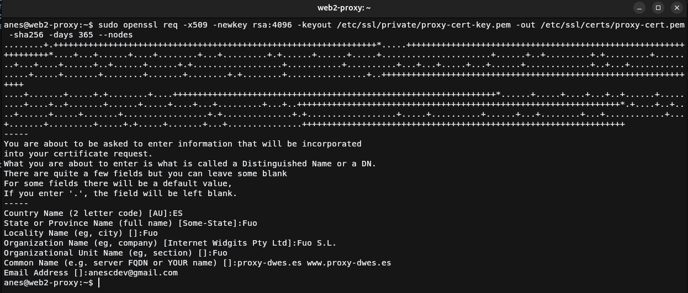
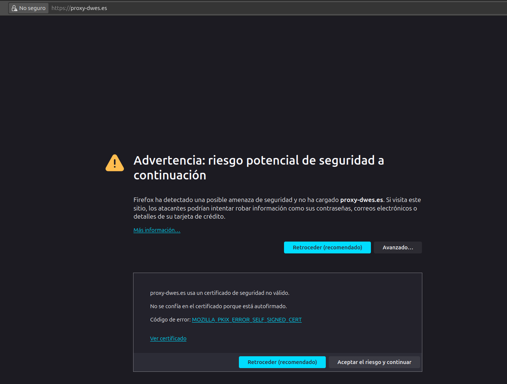
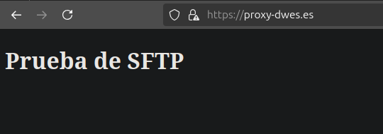

# Practica 2.5: Proxy inverso y balanceo de carga con SSL en NGINX

## Introducción

Para realizar esta práctica vamos a reutilizar la 2.4, ya que lo único que hay que hacerle es configurar el proxy y añadirle un certificado SSL,  por lo que
vamos a ello.
 
Hay que tener en cuenta que normalmente se harían con certificados obtenidos de una autoridad certificadora fiable, pero como no podemos debido a que para ello
el primer paso es tener el servidor abierto a internet, vamos a hacerlo con un certificado autogenerado. 

## Creación del certificado

Para generar el certificado deberemos de ejecutar el siguiente comando, sustituyendo los valores entre menor y mayor que por la ruta que mejor venga 
para tu configuración, yo la voy a poner en la ruta donde Ubuntu guarda los certificados y claves privadas:
```bash
openssl req -x509 -newkey rsa:4096 -keyout <private_key_file> -out <certificate_file> -sha256 -days 365 --nodes
```



Muy importante que en los dos últimos pasos coloquemos los valores que nos piden, en el caso del penúltimo los nombres de host donde se usará el certificado y
un correo válido.

## Configuración del proxy

```nginx
server {
        listen 443 ssl; # Cambiamos puerto al por defecto del protocolo HTTPS y añadimos la directiva SSL
        server_name proxy-dwes.es;
        
        # Añadimos el certificado y su clave privada
        ssl_certificate /etc/ssl/certs/proxy-cert.pem;
        ssl_certificate_key /etc/ssl/private/proxy-cert-key.pem;
        
        # Configuración de protocolo SSL

        ssl_protocols TLSv1 TLSv1.1 TLSv1.2 TLSv1.3;      
        ssl_ciphers HIGH:!aNULL:!MD5;        


        location / {
                proxy_pass https://servers_fuo;
                add_header Host Proxy_Inverso_ManuelJesus;
        }
}
```

Tras añadir estas directivas y cambiar el puerto, únicamente quedará reiniciar el servidor de NGINX para que se ejecute el servidor web con los
nuevos cambios, esto con el siguiente comando:
```bash
sudo systemctl restart nginx
```

## Demostración



Al acceder a la web nos muestra un aviso de que el sitio encripta la información con un certificado autorfirmado, bien, eso significa que ha salido todo bien.
Simplemente le damos a **Avanzado...** y al botón de **Aceptar riesgo y continuar**.



Como se ve, se muestra el contenido del servidor web a través del proxy protegido por HTTPS.

## Cuestiones
### Cuestión 1

!!! question "Enunciado"
    Hemos configurado nuestro proxy inverso con todo lo que nos hace falta pero no nos funciona y da un error del tipo This site can't provide a secure connection, ERR_SSL_PROTOCOL_ERROR.

    Dentro de nuestro server block tenemos esto:
    ```nginx
    server {
        listen 443;
        ssl_certificate /etc/nginx/ssl/enrico-berlinguer/server.crt;
        ssl_certificate_key /etc/nginx/ssl/enrico-berlinguer/server.key;
        ssl_protocols TLSv1.3;
        ssl_ciphers ECDH+AESGCM:DH+AESGCM:ECDH+AES256:DH+AES256:ECDH+AES128:DH+AES:ECDH+3DES:DH+3DES:RSA+AESGCM:RSA+AES:RSA+3DES:!aNULL:!MD5:!DSS;
        server_name enrico-berlinguer;
        access_log /var/log/nginx/https_access.log;

        location / {
            proxy_pass http://red-party;
        }
    }
    ```

El error de esta configuración está en la directiva `listen`, que falta añadirle el parámetro `ssl` después del puerto para habilitar el SSL.
Quedaría de la siguiente forma la configuración
```nginx
server {
    listen 443 ssl; # cambio
    ssl_certificate /etc/nginx/ssl/enrico-berlinguer/server.crt;
    ssl_certificate_key /etc/nginx/ssl/enrico-berlinguer/server.key;
    ssl_protocols TLSv1.3;
    ssl_ciphers ECDH+AESGCM:DH+AESGCM:ECDH+AES256:DH+AES256:ECDH+AES128:DH+AES:ECDH+3DES:DH+3DES:RSA+AESGCM:RSA+AES:RSA+3DES:!aNULL:!MD5:!DSS;
    server_name enrico-berlinguer;
    access_log /var/log/nginx/https_access.log;

    location / {
        proxy_pass http://red-party;
    }
}
```
### Cuestión 2
!!! question "Enunciado"
    Imaginad que intentamos acceder a nuestro sitio web HTTPS y nos encontramos con el siguiente error:
    
    Investigad qué está pasando y como se ha de solucionar: 

Es un error donde el certificado que usa el servidor NGINX ha sido retirado o revocado por la autoridad de certificación 
que lo ha expedido debido a diversos problemas, entre ellos dar información incorrecta durante la creación del certificado y haciéndolo
inválido. También puede deberse a problemas de conexión a la lista de certificados revocados de la autoridad y al no poder acceder para comprobar si
es un certificado válido, da ese error.

Para solucionar esto habría que expedir un certificado nuevo y asegurarse que todo es correcto