# Práctica de amplicación: Configuración de un servidor Nginx con Hosts Virtuales y directorios de usuario

En esta práctica se configurará un servidor web que servirá diferentes rutas de los usuarios que vamos a crear en la misma práctica
!!! warning  "Aviso"
    Para no hacer excesivamente largo el documento, las capturas que requieran exactamente la misma configuración cambiando por ejemplo el
    nombre de usuario, solo se hará una vez.

## Conexión al servidor

Para realizar la práctica se hará tal y como se pidió en clase, mediante SSH por lo que para demostrar esto dejo la captura de pantalla que 
muestra como me conecto al servidor

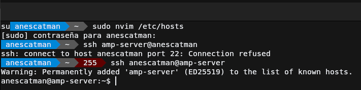

## Usuarios y carpetas

En este apartado se va a mostrar como crear los usuarios, la estructura de carpetas con sus permisos correspondientes y la página de pruebas 
para comprobar que todo funcione correctamente.

### Creación de usuarios

Para crear los usuarios vamos a crearlos lo más básico posible ya que no lo usaremos como usuario de trabajo frecuente, únicamente nos hace falta
que pueda iniciar sesión y que tenga su carpeta de usuario respectiva. Para ello usaremos los siguientes comandos:
```bash
sudo useradd -m -s /bin/bash <usuario> # Crear el usuario con carpeta home y que su shell por defecto sea bash
sudo passwd <usuario> # Definimos contraseña al usuario
```

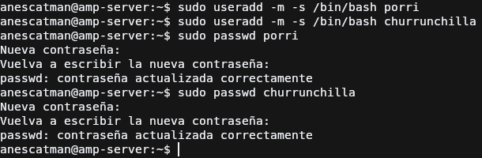

### Creación de estructura de carpetas

La carpeta a la que Nginx accederá será `public_html`, el nombre por defecto de la carpeta donde está las páginas web en los directorios
de usuario, por lo que para crear esta carpeta deberemos de:

1. Iniciar sesión con el usuario y acceder a su carpeta home (`su <usuario` y después `cd ~`)
2. Crear la carpeta la carpeta anteriormente mencionada (`mkdir public_html`)
3. Cambiar los permisos para que pueda acceder nginx. Estos permisos en vez de hacerlos de forma tradicional, lo haremos usando las ACL,
    un sistema de permisos alternativo pero aceptado dentro de la comunidad de Linux, el cuál trae por defecto instalado. 
    
    Este lo que permite es crear una máscara de permisos mas específica completa, permitiéndonos hacer de forma sencilla lo que queremos 
    en este caso que es que el usuario de nginx `www-data` pueda acceder a la carpeta y a los nuevos archivos que el usuario vaya creando 
    dentro de esta carpeta. El comando sería el siguiente: 
    ```bash
    setfacl -d -R -m u:www-data:rw public_html
    ```

    El comando usa una serie de argumentos y después la carpeta o archivo donde se aplicará la máscara de permisos especiales. Los parámetros
    que hemos usado son:

    * `-d`: Indica que cada archivo nuevo o directorio dentro de esta carpeta, se aplicará la regla ACL de más abajo
    * `-R`: Se aplicará de forma recursiva, inútil ahora mismo ya que no hay ningún archivo creado pero por costumbre prefiero ponerlo.
    * `-m`: Parámetro para indicar la regla ACL que queremos aplicar al archivo, sigue este patrón `<(u|g)>:<(usuario | grupo)>:<r | w | x>`. 
        
        Para entender el patrón lo dividiremos en tres partes, en la primera indicamos a que va a aplicar la regla, si a un usuario o un grupo,
        en la segunda parte a que usuario o grupo afectará la regla y en la tercera el permiso que tendrá ese usuario o grupo. 
        
        Algo extra a añadir, es que en el patrón podemos añadir mas tipos de ACL, es decir a parte de usuario y grupo pues podemos añadir también 
        a "otros usuarios" para establecer los permisos del archivo o directorio en general pero este por ejemplo desde mi opinión es mas útil 
        establecerlo con el sistema tradicional de permisos de linux, es decir con `chmod`.

Tras esto para comprobar que todo funciona correctamente se usa el siguiente comando para ver si las ACL son correctas:
```bash
getfacl <ruta_carpeta>
```

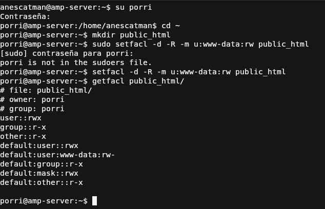

### Creación de páginas webs estáticas

Para comprobar que todo es correcto se creará un archivo `index.html` para cada usuario en su carpeta `public_html`, con el fin de que se 
muestre como página principal y comprobar que todo funciona correcamente.

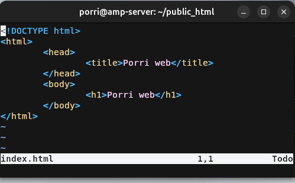

## Nginx

### Instalación de NGINX

Para poder instalar Nginx en Debian 12 tenemos dos formas, mediante APT y manualmente, obviamente lo haremos mediante el gestor de paquetes APT ya
que es más cómodo y más rápido y no nos hace falta una versión en específico antigua.

Se ejecutarán los siguientes comandos (aunque en la captura salgan en una sola línea):
```bash
sudo apt-get update # Actualiza la lista de repositorios
sudo apt-get upgrade # Actualiza los paquetes que tengan una nueva versión disponible
sudo apt-get install nginx # Instala el servidor web Nginx
```

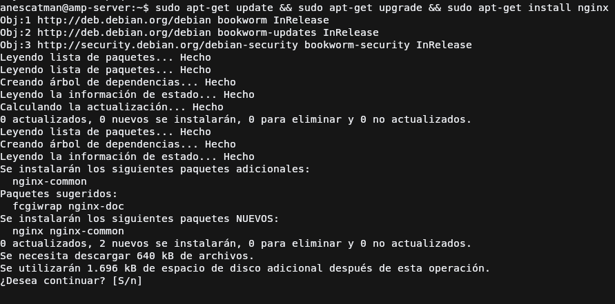

Para comprobar que está funcionando se puede hacer el comando `systemctl status nginx` y comprobar el estado del servicio pero también 
podemos intentar acceder al servidor web mediante un navegador y comprobar que muestra la página web por defecto de Nginx, como en la captura.

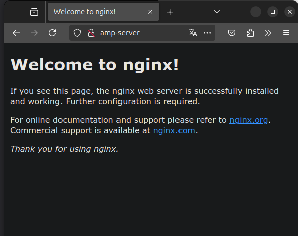

### Configuración básica de NGINX
La configuración por defecto de NGINX que nos proporciona APT para este ejemplo nos será mas que suficiente para realizar la práctica, 
lo que si haremos es la configuración de los hosts pero esto será más adelante.

### Generar certificado para HTTPS

Para hacer que NGINX sirva la página web usando HTTPS como ya sabemos necesitamos indicarle que certificado usar para cifrar los datos,
para ello normalmente se usa uno que nos proporcionaría una autoridad certificadora oficial, pero como para ello necesitamos que primeramente
el servidor esté ya en Internet y no en nuestra red local, usaremos directamente uno autofirmado, el cual se generará con el siguiente comando.
```bash
openssl req -x509 -newkey rsa:4096 -keyout <private_key_file> -out <certificate_file> -sha256 -days 365 --nodes
```

Este comando para entenderlo lo deglosaremos en sus parámetros:

* **req**: comando que indica a openssl que vas a iniciar una petición de firmado de certificado.
* **x509**: indica que usará la estructura de certificado X.509.
* **newkey**: indica que generará una clave usando el algoritmo indicado despues con `<algoritmo>:<bits>`.
* **keyout**: archivo donde se guardará la clave privada.
* **out**: archivo donde se guardará el certificado.
* **sha256**: indicamos que el certificado usará SHA-256 para calcular el hash.
* **days**: número de días de válidez del certificado.
* **nodes**: no encripta la clave privada, por lo que no nos pedirá contraseña para la clave. Lo usamos aquí para que
no de problemas con Nginx al momento de importarla en el host. **Recomendable usar el parámetro `noenc` ya que `nodes` está en desuso pero aun funciona.**

Los certificados los generaré en el directorio `/etc/ssl/certs/` y su correspondiente clave privada en `/etc/ssl/private`, uno por cada dominio.

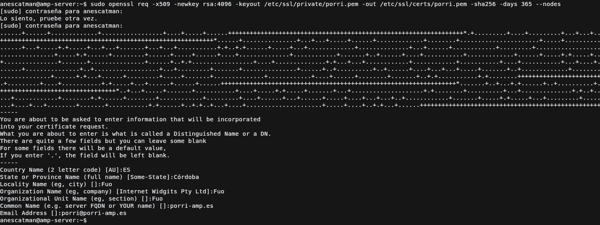

### Creación de los hosts virtuales

Para crear los hosts virtuales, tendremos en cuenta que ya se servirán encriptados los datos, pero para que quede lo mejor posible, también haremos
la configuración para el protocolo HTTP que redirigirá a HTTPS y así no muestra un error feo al usuario.

Empezemos con la redirección ya que es lo más sencillo, en el mismo archivo de configuración del host virtual crearemos un bloque `server {...}` con
dicha configuración, quedaría de la siguiente forma: 
```nginx title="/etc/nginx/sites-available/porri"
...
server {
    # Escucha en el puerto 80 por IPV4
    listen 80; 
    # Escucha en el puerto 80 por IPV6
    listen [::]:80;

    # Nombre del host que está escuchando
    server_name <nombre_host>; 

    location / {
        # Redirección hacia HTTPS al mismo host y mismo recurso.
        return 301 https://$host:$request_uri; 
    }
}
...
```

Una vez hecha la redirección vamos a hacer la configuración del host para el puerto 443:
```nginx title="/etc/nginx/sites-available/porri"
...
server {
    # Escucha en el puerto 443 por IPV4
    listen 443 ssl; 
    # Escucha en el puerto 443 por IPV6
    listen [::]:443 ssl;

    # Directorio del que servirá los archivos, en este caso la carpeta 
    # public_html de los usuarios
    root <direccion_raiz_servidor>;

    # Rutas a los archivos generados del certificado
    ssl_certificate <direccion_certificado_tls-ssl>;
    ssl_certificate_key <direccion_clave_privada_certificado_tls-ssl>;

    # Archivo que buscará de índice
    index index.html;

    # Nombre del host que está escuchando
    server_name <nombre_host>; 

    location / {
        # Redirección hacia HTTPS al mismo host y mismo recurso.
        return 301 https://$host:$request_uri; 
    }
}
...
```

Si nos fijamos, faltan algunas directivas como por ejemplo la que indica el tipo de cifrado, si usa SSL, TLS, etc... Esto podemos saltarlo gracias
a que está configurado en el archivo principal de configuración de nginx de `/etc/nginx/nginx.conf`.

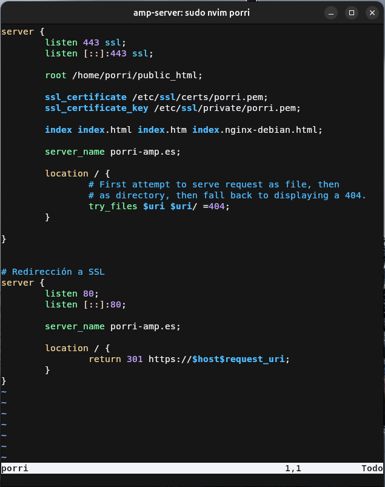

### Habilitación de los hosts virtuales

Para habilitar los hosts virtuales debemos de crear un enlace simbólico de las configuraciones que acabamos de hacer al directorio 
`/etc/nginx/sites-enabled`, para ello usaremos el siguiente comando:
```bash
sudo ln -s /etc/nginx/sites-available/<archivo_configuración> /etc/nginx/sites-enabled
```

Una vez hecho este comando debemos de ejecutar el comando que comprueba si la configuración actual es correcta:
```bash
sudo nginx -t
```

Si sale que todo es correcto, ya podremos reiniciar el servicio de Nginx con el siguiente comando para comprobar el acceso a las webs:
```bash
sudo systemctl restart nginx
```

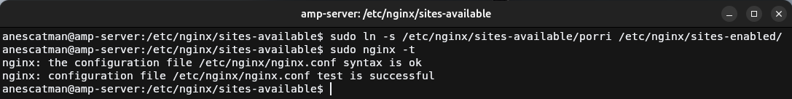

### Añadir al host del anfitrión nombre de hosts

Para poder acceder a los hosts virtuales debemos de dirigirnos al dominio que hemos configurado en las directivas `server_name`, de forma normal 
esto se haría mediante un servidor DNS, pero debido a que no lo tenemos instalado ni tampoco comprado un dominio, debemos de modificar el archivo
`hosts` de nuestro sistema operativo para que esos dominios hagan referencia a la máquina virtual. 

En todos los sistemas operativos principales
usan el mismo formato, lo único que puede cambiar el donde lo almacenan. En la captura se muestra en un sistema operativo UNIX-Like, pero en 
Windows se encuentra en `C:\Windows\System32\drivers\etc\hosts`.

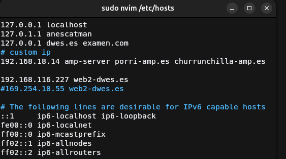

### Prueba de funcionamiento de los hosts

Ahora probaremos acceder a cada dominio con un navegador web, mostraremos el aviso de que usa un certificado autofirmado para encriptar los
datos, la web y el certificado generado de cada dominio

#### Porri web

---

**Aviso de que usa un certificado autofirmado**
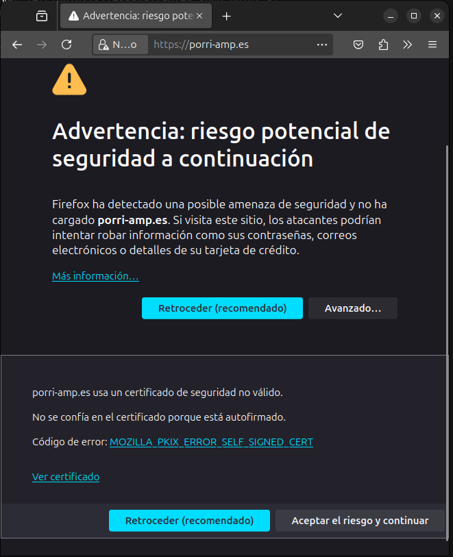

**Mostramos la Porri web**
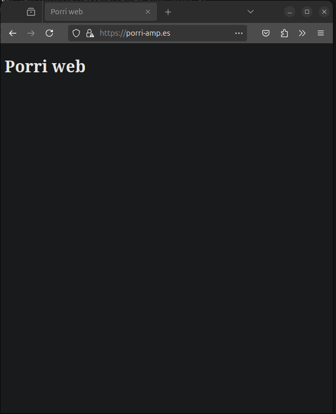

**Mostramos certificado SSL/TLS**

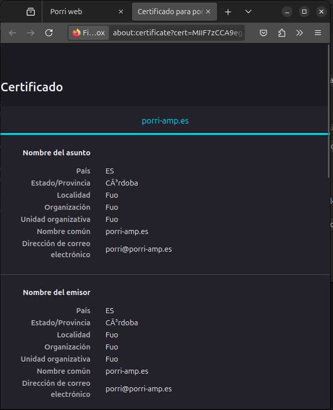

#### Churrunchilla web

---

**Aviso de que usa un certificado autofirmado**
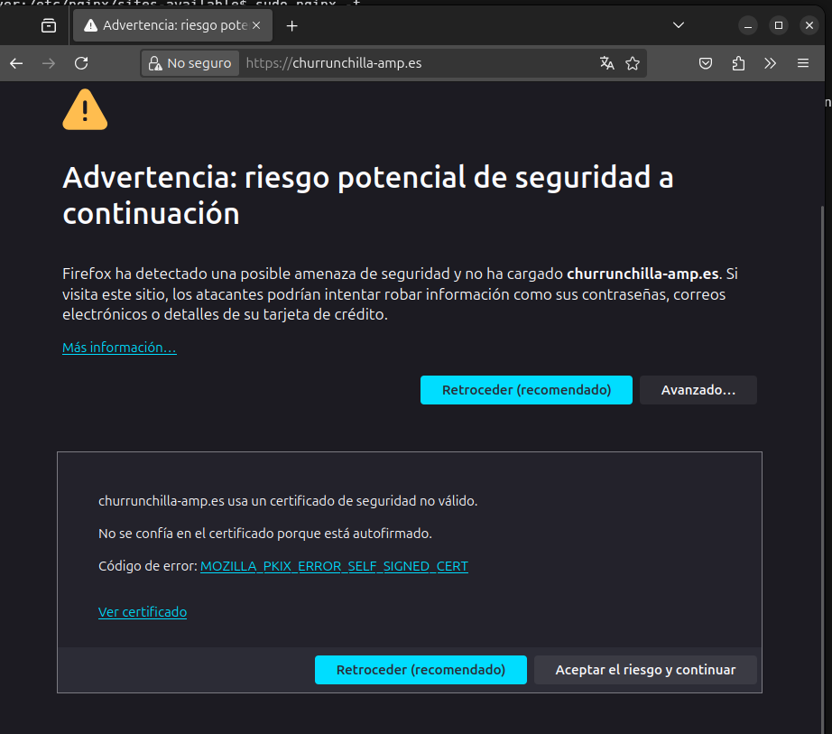

**Mostramos la Churrunchilla web**
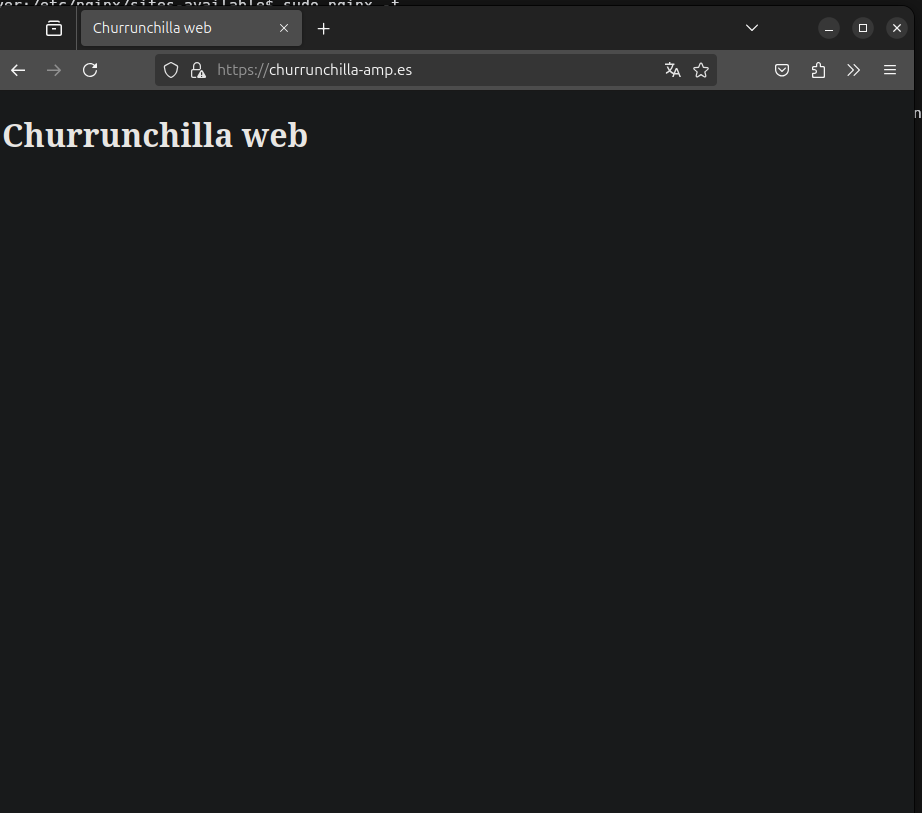

**Mostramos certificado SSL/TLS**
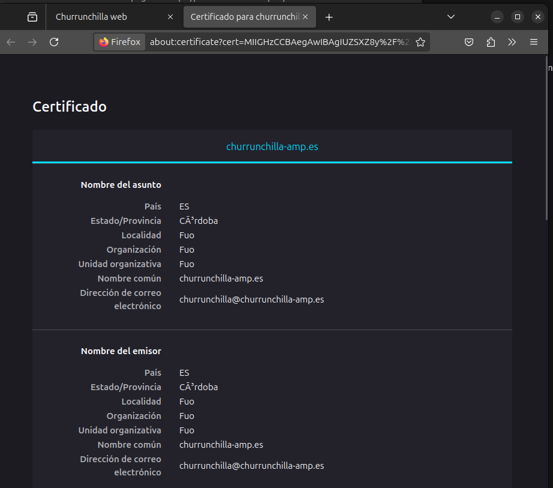