#  Práctica 3.1: Instalación de Tomcat y Maven para despliegue de aplicación Java

## Tomcat
Tomcat es un servidor de aplicaciones Java muy conocido que permite gestionar instancias de aplicaciones webs y desplegarlas 
de forma automática o de forma manual. En esta práctica veremos como instalarlo en Debian 12 y como desplegar aplicaciones 
en el servidor, tanto manual como automáticamente
### Prerequisitos
Para poder instalar Tomcat, debemos instalar Java ya que está desarrollado en esa tecnología, en mi caso voy a instalar
la versión 17 ya que es la versión por defecto que ofrecen los repositorios oficiales de Debian 12. Para ello instalamos 
el JRE, ya que para ejecutar aplicaciones, no nos hace falta el JDK.
```bash
sudo apt-get install default-jre
```
A día de 12-11-2024 la versión por defecto es la 17, en un futuro es posible que cambie por lo que deberás de tenerlo 
en cuenta y asegurarte de que la versión de Tomcat sea compatible con esa.

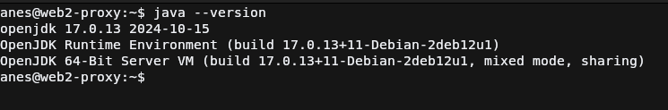

Si todo ha salido bien, al usar java --version debería de imprimir la versión instalada tal y como en la captura
de pantalla.

### Instalación de Tomcat
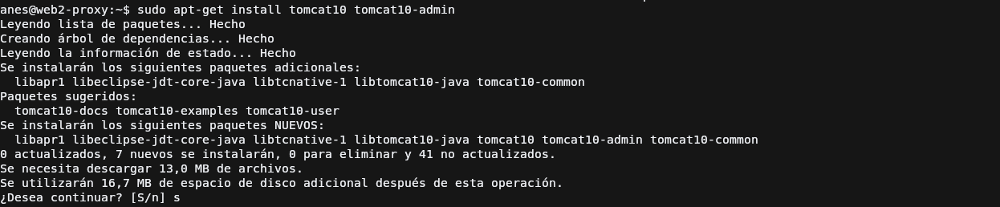

Para instalar Tomcat 10, Debian 12 ofrece en sus repositorios oficiales un paquete para que su instalación sea 
lo más sencilla posible en su sistema, por lo que tiraremos de ese paquete usando el comando que se muestra en la captura 
para comenzar con su instalación.
```bash
sudo apt-get install tomcat10 tomcat10-admin # tomcat10-docs
```
El paquete tomcat10-docs es para que puedas tener su documentación offline, instalar si lo ves necesario.

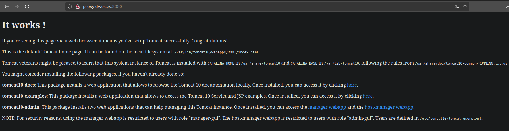
!!! danger "IMPORTANTE"
    Si tienes una aplicación que esté escuchando en el puerto `8080`, Tomcat **no podrá iniciar** a no ser que cambies el puerto
    en Tomcat o cierres la aplicación.


Una vez instalado solo queda ejecutar el servicio con el comando:
```bash
sudo systemctl start tomcat10
```

Este comando no es necesario ponerlo siempre ya que al instalar tomcat, apt configura tomcat para que se ejecute al inicio
del servidor, en caso de que no haga esto simplemente ejecutar el comando: 

```bash
sudo systemctl enable tomcat10
```

Y cuando reinicies el servidor se ejecutará al inicio.

Entonces ya podrás entrar a la aplicación web de Tomcat, en la siguiente URL: `http://<dirección_servidor>:8080`. Se mostraría
algo como en la captura de pantalla


### Configuración tomcat

Para poder usar el panel de administración debemos de crear un usuario de en el XML de configuración de Tomcat,
en este caso al instalarlo con apt, este archivo está en la ruta que muestra el directorio que muestra el bloque de código.

Para crear un usuario nos tenemos que posicionar dentro de la etiqueta `<tomcat-users>`, y escribir la etiqueta `user` que
contendrá un atributo para el nombre de usuario, otro para la contraseña y otro para escribir los roles del usuario separados
por coma.
```xml title="/etc/tomcat10/tomcat-users.xml"
<?xml version="1.0" encoding="UTF-8"?>
... 
<tomcat-users xmlns="http://tomcat.apache.org/xml"
              xmlns:xsi="http://www.w3.org/2001/XMLSchema-instance"
              xsi:schemaLocation="http://tomcat.apache.org/xml tomcat-users.xsd"
              version="1.0">
<!--Comentarios que explica el tema de la configuración del usuario-->
  <user username="anes" password="anes" roles="admin-gui,manager-gui"/>
```

Una vez hecho esto deberemos de guardar el archivo y reinciar el servicio de Tomcat para que cargue el usuario creado,
esto se hace con el siguiente comando: 
```bash
sudo systemctl restart tomcat10
```

### Acceso al panel
Para comprobar accedemos a la URL `/manager/html`, entonces nos pedirá un usuario y contraseña por medio de Basic Authentication,
le indicamos el que hemos creado en el archivo XML e iniciamos sesión

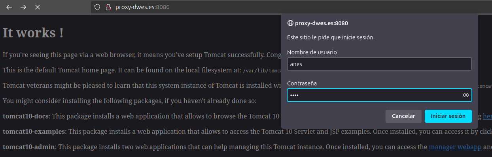

Si todo ha salido como debía, se debe de mostrar un panel como en el de la siguiente captura, en el que podremos desplegar y
gestionar las aplicaciones web de Java.

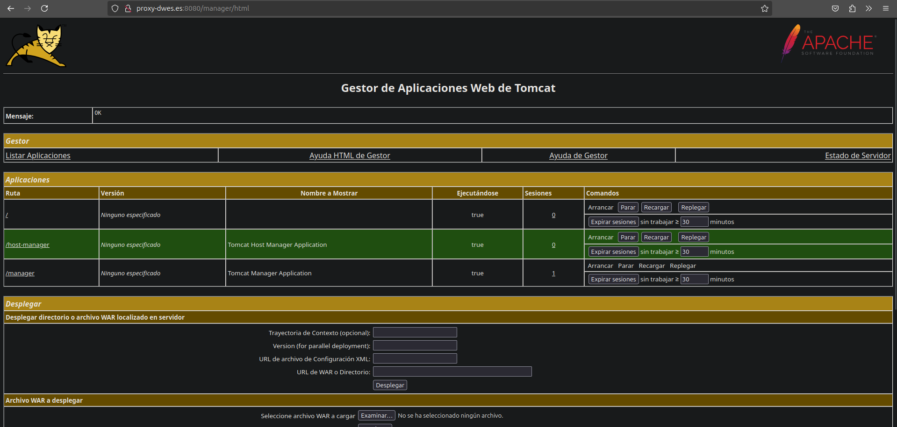

## Despliegue Manual de Jar
!!! info "Enlace de descarga del WAR"
    [https://tomcat.apache.org/tomcat-6.0-doc/appdev/sample/](https://tomcat.apache.org/tomcat-6.0-doc/appdev/sample/)
Para comprobar que el despliegue de aplicaciones se hace correctamente, usaremos el WAR de prueba proporcionado por Tomcat
debido a que el WAR proporcionado por Moodle por alguna razón crasheaba al hacer el intento de despliegue.

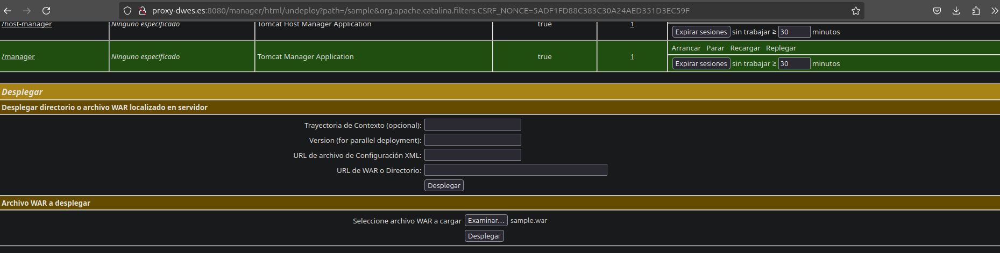

Para subirlo de forma manual por medio del GUI, Tomcat nos proporciona un dos formularios, uno donde podemos desplegar un WAR
que ya está presente en el sistema de archivos del servidor, o subir desde nuestro equipo el WAR, que será el formulario que
usaremos, elegiremos el archivo usando el campo correspondiente y daremos click en el botón de Desplegar.

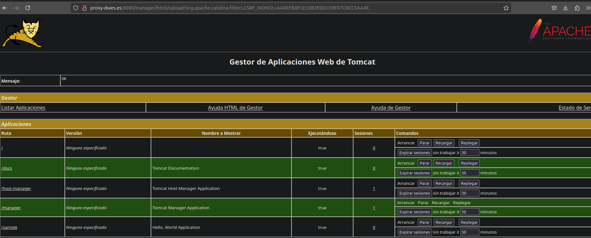

Como se ve en el listado de aplicaciones se muestra la aplicación sample que es la que hemos subido, y el botón de `Desplegar`
está desactivado nos indica que está en ejecución la aplicación web.

Para acceder a ella y probar haremos click sobre le nombre de la aplicación web, que nos redirigirá a la URL donde se desplegó.

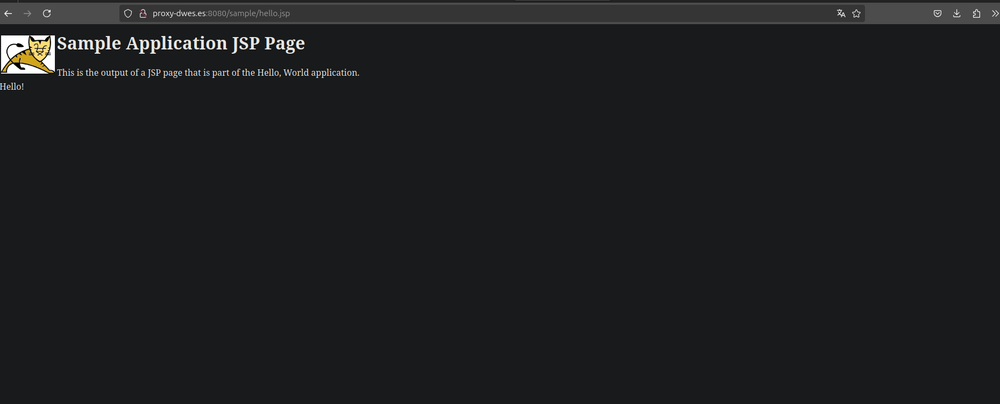

Como se ve en la captura, la app funciona correctamente por lo que ya podemos ir al siguiente punto.

## Despliegue automático

Cuando trabajamos con un proyecto de Java Maven, esta herramienta nos permite entre otras, desplegar la aplicación cuando 
sintamos que está preparada para producción (en verdad se usaría CI/CD pero para esta práctica lo haremos así).

### Instalación de Maven

Para configurar un proyecto Maven con esa funcionalidad, el primer paso es tener instalado Maven que tiene un paquete 
en los repositorios de Debian 12, por lo que nos valdremos del siguiente comando para instalarlo.

```bash
sudo apt-get install maven
```
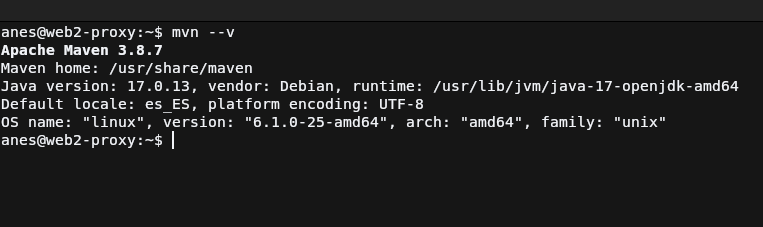

Para comprobar que ha sido instalado correctamente simplemente ejecutamos el comando que se ve en la captura para que 
muestre la versión de maven instalada.

### Configuración de usuario de Tomcat para Maven

Para poder desplegar desde Maven, se recomienda crear en Tomcat un usuario exclusivamente para esta tarea que tenga el rol de 
`manager-script` que da acceso al usuario usar la API HTTP de Tomcat


Se deberá de hacer en el mismo fichero donde se creo el usuario del administrador de aplicaciones web, es decir `/etc/tomcat10/tomcat-users.xml`

Se guarda el archivo y se reinicia el servicio de Tomcat para que cargue el usuario creado con el comando:
```bash
sudo systemctl restart tomcat10
```

### Añadir usuario al listado de servidores de Maven

Ahora tenemos que añadir en la configuración de servidores de Maven las credenciales del usuario de Tomcat para que cuando llegue
el momento de despliegue, las obtenga de ahí. Por lo que primeramente modificaremos el archivo `/etc/maven/settings.xml`, buscando la etiqueta
`servers` y añadiendo una etiqueta `server` dentro de esta que contendrá 3 etiquetas dentro:

* `id`: Id del servidor en maven, puede ser el que quieras
* `username`: usuario del servidor, en este caso el de Tomcat
* `password`: contraseña del servidor, en este caso la de Tomcat

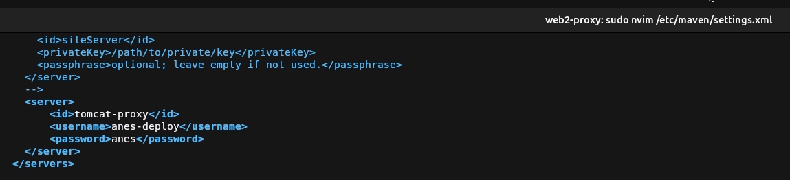

Guardamos el archivo y vayamos al siguiente paso

### Configurar un proyecto de Java Maven

Para este paso necesitaremos un proyecto Java que use Maven, podemos generarlo con un archetype pero en este caso usaremos el repositorio que
la práctica propone para la tarea 1 y así matar dos pájaros de un solo tiro. Clonamos el repo con el siguiente comando, que después accederá
para cambiar la rama a `patch-1`.
```bash 
git clone https://github.com/cameronmcnz/rock-paper-scissors.git && cd rock-paper-scissors && git checkout patch-1
```
#### Configuración del POM
Una vez aquí debemos de acceder al fichero `pom.xml` que es el que usa Maven para configurar un proyecto Java, pues dentro de este debemos de buscar
la etiqueta `plugins` y asegurarnos que esté contenida por `build` (no tiene que ser hijo directo). Una vez localizado debemos de crear una etiqueta
`plugin` que contenga exactamente el mismo contenido que el último plugin de la captura, vamos a saltar directamente a la etiqueta `configuration` ya que las demás son comunes de maven: 

* `url`: Url de tomcat a la que se conectará para subir los cambios, esta será la dirección al servidor de Tomcat mas el path `/manager/text`.
* `server`: Aquí colocaremos el id del servidor que configuramos en el paso anterior para que obtenga las credenciales para el deploy
* `path`: Será la ruta donde se desplegará la aplicación

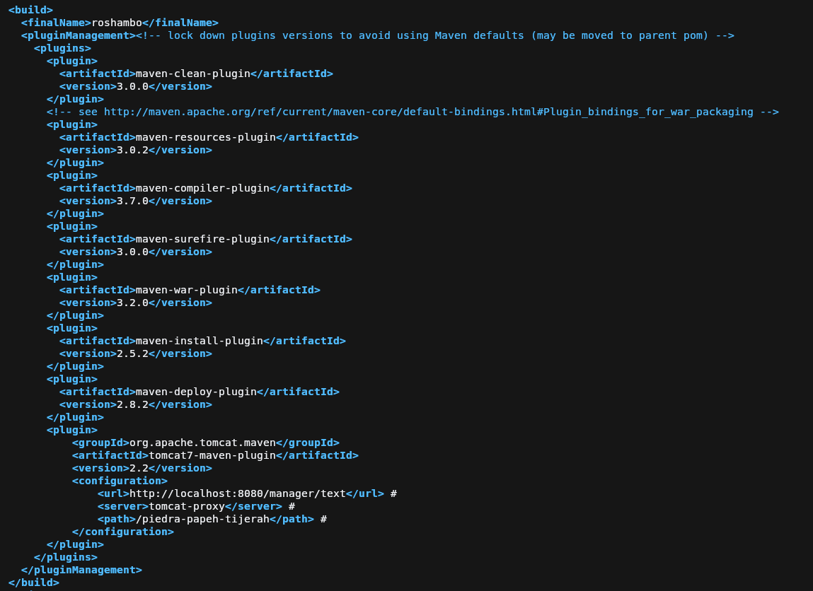
#### Despliegue del proyecto

Para desplegar nos valdremos del comando `mvn tomcat7:deploy` que se encargará de compilar y mandar los archivos compilados al servidor de tomcat 
según los parámetros configurados previamente. Tal y como se hace en la siguiente captura con el resultado de lo que debería salir si todo sale bien.

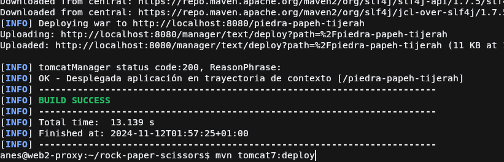

Ahora accedemos al panel de Tomcat para comprobar que la aplicación fue desplegada con éxito


Para terminar comprobaremos si funciona la aplicación web descargada, accediendo a la ruta donde la desplegamos

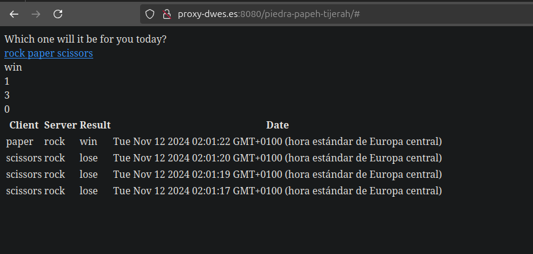

## Cuestiones
!!! task "Cuestión 1"
    Habéis visto que los archivos de configuración que hemos tocado contienen contraseñas en texto plano, por lo que cualquiera con acceso a ellos obtendría las credenciales de nuestras herramientas.

    En principio esto representa un gran riesgo de seguridad, ¿sabrías razonar o averigüar por qué esto está diseñado de esta forma?

Esto es debido a que se espera que el administrador del sistema al instalar tomcat, estos ficheros únicamente sean accesibles por root y por el 
usuario que ejecuta Tomcat y por ninguno más, para así proteger las contraseñas, tal y como el archivo `/etc/shadow` que no puede verlo nadie
sin permisos de administrador.