# Práctica 3.2: Despliegue de aplicaciones con Node Express y en Netlify
Nono no intentes arreglarlo
## Instalación de NodeJS
NodeJS es un entorno de ejecución de Javascript que permite interpretar archivos JS sin necesidad de un navegador, haciendo que
con el mismo lenguaje de programación que en la web, puedas contruir aplicaciones de servidor, y a día de hoy con todos los avances
es una de las opciones mas recomendadas para ello, aunque influye también el tipo de proyecto.

Para instalar NodeJS simplemente ejecutamos el comando que aparece en la pantalla
```bash
sudo apt-get update && sudo apt-get install nodejs npm
```
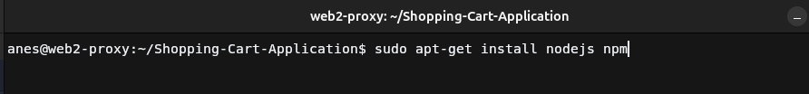

El segundo paquete es `npm`, el gestor de dependencias por defecto de NodeJS. Es muy recomendable tenerlo instalado para poder usar
librerias ya hechas, como ExpressJS.

## Despliegue con NodeJS

Desplegar una aplicación de NodeJS, es muy sencillo ya que podemos centralizarlo todo en un comando definido dentro del `package.json`, 
fichero donde se define la información del proyecto de nodejs y sus dependencias.

### Clonación del proyecto Express

Para probar esto usaremos una aplicación de prueba que usa la librería ExpressJS para poner una aplicación web a la escucha,
vamos al repositorio y lo clonamos con el comando que se ve en pantalla.

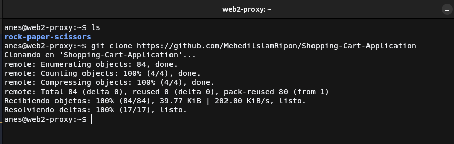

Una vez clonada la carpeta, accedemos a esta e instalamos todas las dependencias necesarias del proyecto, esto se hace 
mediante el comando `npm install`, que se puede usar para instalar una dependencia en específico en un proyecto de Node o para
instalar las dependencias que usa un proyecto, en este caso lo usaremos para instalar las necesarias del proyecto ejecutando el
comando sin ningún parámetro o colocando un `.` que indica el directorio actual en el caso que estemos en la raíz del proyecto.

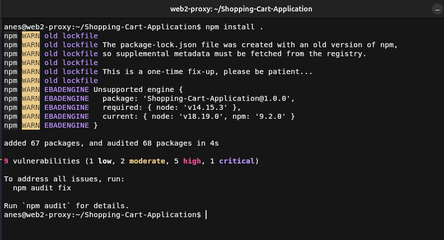

Ahora para probar que funciona todo correctamente, usamos el comando `npm start` que es un script por defecto de npm que permite
ejecutar un comando, que se indica en el archivo `package.json`

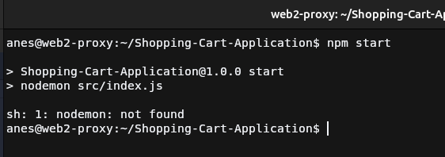

Si nos fijamos, nos da un error al intentar ejecutar el proyecto de NodeJS, esto es debido a que no encuentra la dependencia de `nodemon`
ni en el sistema ni en el proyecto.

### Arreglo del fallo
!!! Question "nodemon not found"
    Buscad cómo solucionar este problema y, tras ello, iniciad la aplicación sin problemas.

    ¿Qué comando habéis usado para solucionar el fallo anterior?¿Cuál es su cometido?¿Qué archivo se ha modificado al ejecutarlo? Documéntalo todo en el informe de la práctica. 

Para arreglar el fallo he usado el comando de `npm install nodemon`, el cuál como he explicado anteriormente se usa para instalar dependencias de
proyectos, e inclusos para instalar dependencias de forma global en el sistema, pero eso no entra ahora.

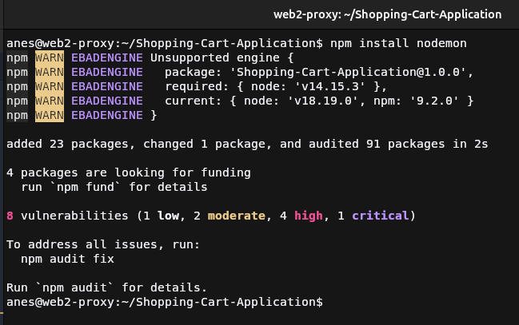

Tras instalar la dependencia faltante y volver a usar `npm start` ahora si se habrá puesto en escucha con éxito el servicio, por lo que ya podemos
acceder a este por medio del navegador.

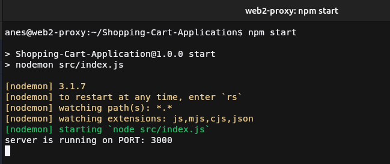

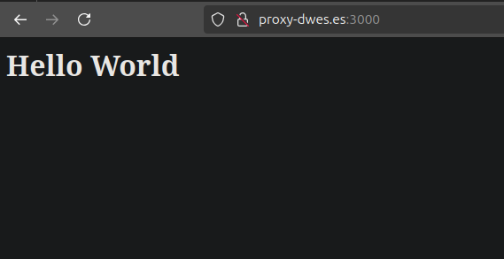

## Despliegue en Netlify

### Prerrequisitos

Para poder desplegar en este SaaS, debemos de tener una cuenta en la plataforma. Puedes iniciar sesión con tu cuenta de Github si deseas.

### Despliegue manual mediante CLI

Para hacer el despliegue manual desde tu equipo de desarrollo necesitamos dos cosas:

* Un token para autorizar el despliegue e indicar que somos nosotros el que despliega.
* Netlify CLI, la utilidad de consola que permite hacer los despliegues de forma sencilla a los desarrolladores.

#### Obtención del token

Para crear un token nos tenemos que dirigir a los ajustes de usuario de Netlify y una vez dentro en el apartado de `Applications`, 
tendremos que hacer click sobre `New Access` y así nos mandará a la página de creación del token, le ponemos un nombre, indicamos la fecha
de expiración y lo generamos.

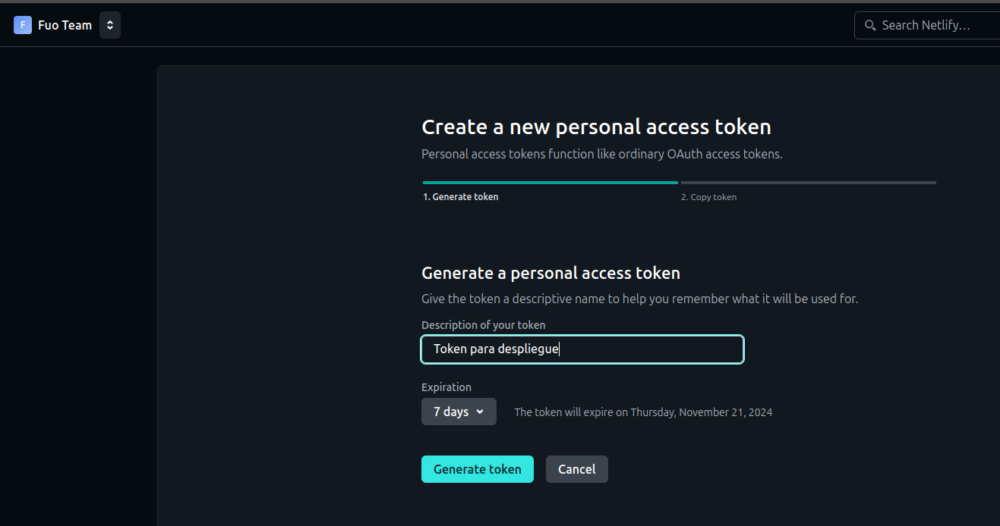

Ahora para que el CLI pueda iniciar sesión con el token creado debemos de guardarlo en una variable de entorno, para ello copiamos el token
y en caso de Debian 12, accedemos a `$HOME/.bashrc` y aquí dentro al final tendremos que añadir la variable `NETLIFY_AUTH_TOKEN` usando la
palabra clave `export` para que esta variable la puedan usar otros procesos del sistema.

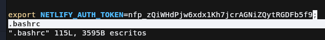

Una vez hecho esto debemos de hacer que detecten la nueva variable de entorno, esto se puede hacer saliendo y entrando al SSH de nuevo, o más
cómodo, con el comando source, que vuelva a leer el archivo `.bashrc` y cargue la nueva variable de entorno en el sistema.
```bash
source ~/.bashrc
```

#### Instalación de Netlify CLI

Para instalar el CLI de Netlify en vez de usar APT usaremos npm ya que como dije anteriormente, permite instalar aplicaciones a nivel global además
del ámbito de proyecto, por lo que se usará el comando que se ve en la captura que incluye el parámetro `-g`. 

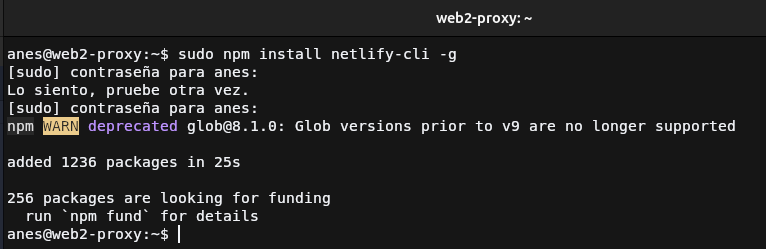

Una vez instalado usamos el comando `netlify login` para que inicie sesión con el token almacenado en la variable de entorno.

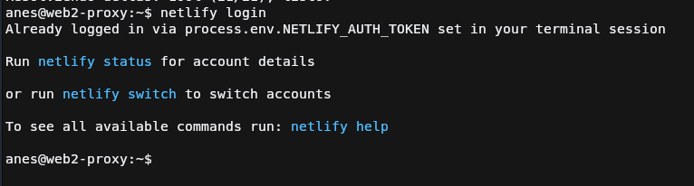

#### Despliegue manual

Para hacer la prueba vamos a clonar una aplicación web de React que hace variaciones de un color

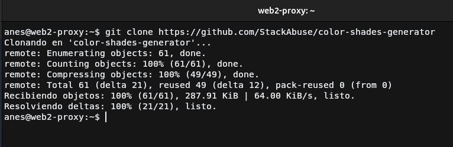

Normalmente al desarrollar una aplicación web, actualmente necesita de un proceso de empaquetado o
transpilación, o minificación antes de ponerla en producción, en este caso únicamente necesitamos contruir 
la aplicación y ponerla a funcionar, para ello usaremos el comando `npm run build` que fue configurado previamente
en el `package.json` por el desarrollador. Antes obviamente debemos de instalar las dependencias del proyecto.

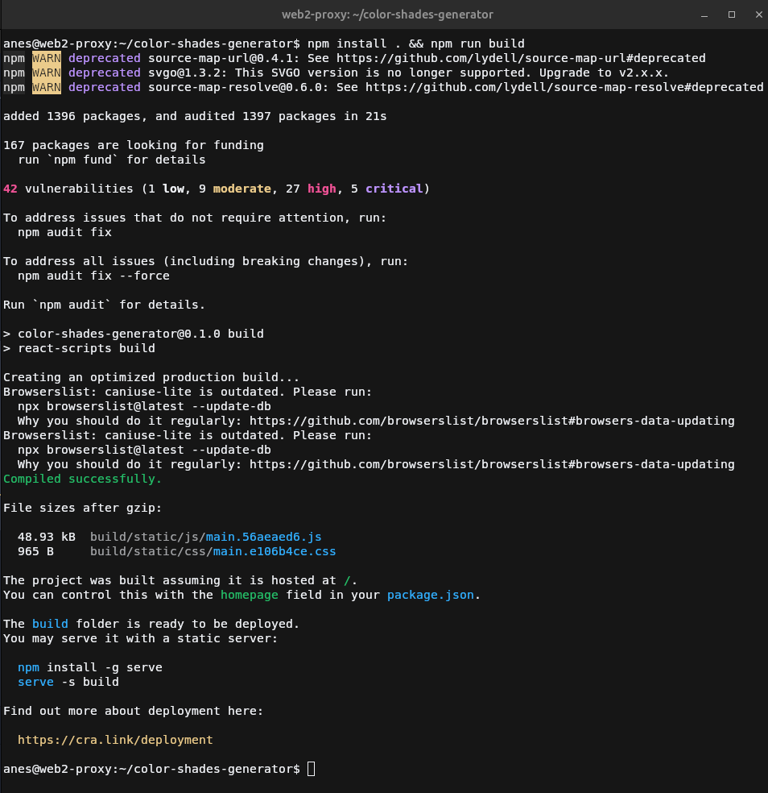

Una vez hecho esto y comprobado que se ha construido correctamente la app, ya podremos hacer el deploy en Netlify. Para
esto simplemente debemos de ejecutar el comando de `netlify deploy` y contestar las siguientes preguntas que nos harán:

1. Elegir si queremos hacer deploy en un sitio ya existente o crear uno nuevo, en nuestro caso creamos uno nuevo.
2. Nombre del team al que va a pertenecer el sitio
3. Nombre del sitio donde se hará el deploy
4. Directorio que contiene la aplicación construida

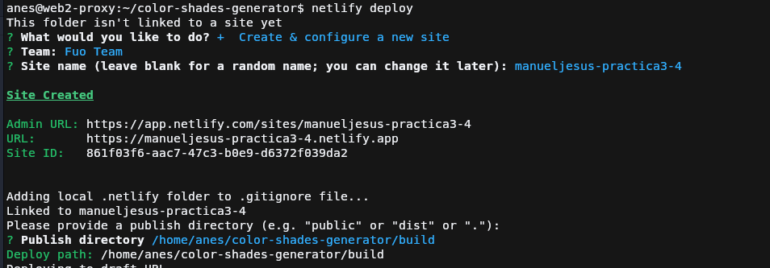

Una vez se ha completado el despliegue en modo de pruebas y todo ha salido bien tal y como se muestra en la captura, debemos de 
desplegarla en producción, esto se hace con el mismo comando pero añadiendo el parámetro de `prod`, quedando de la siguiente forma:
```bash
netlify deploy --prod
```

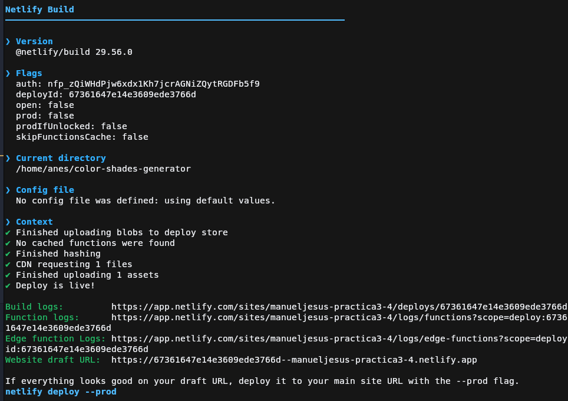

Una vez hecho esto, nos mostrará al final la URL del sitio desplegado y es la que tenemos que pasar a nuestros usuarios ya que es la que 
hace falta para conectarla.


### Despliegue automático mediante repositorio

#### Borrado del anterior despliegue

Para realizar el despliegue automático vamos a borrar la otra aplicación ya que solo nos servia para mostrar el ejemplo anterior, para 
ellos nos dirigimos al Dashboard y buscamos el sitio creado, clickamos sobre el y en la configuración del sitio bajamos hasta encontrar
el botón de `Delete this site`, clickamos sobre este.

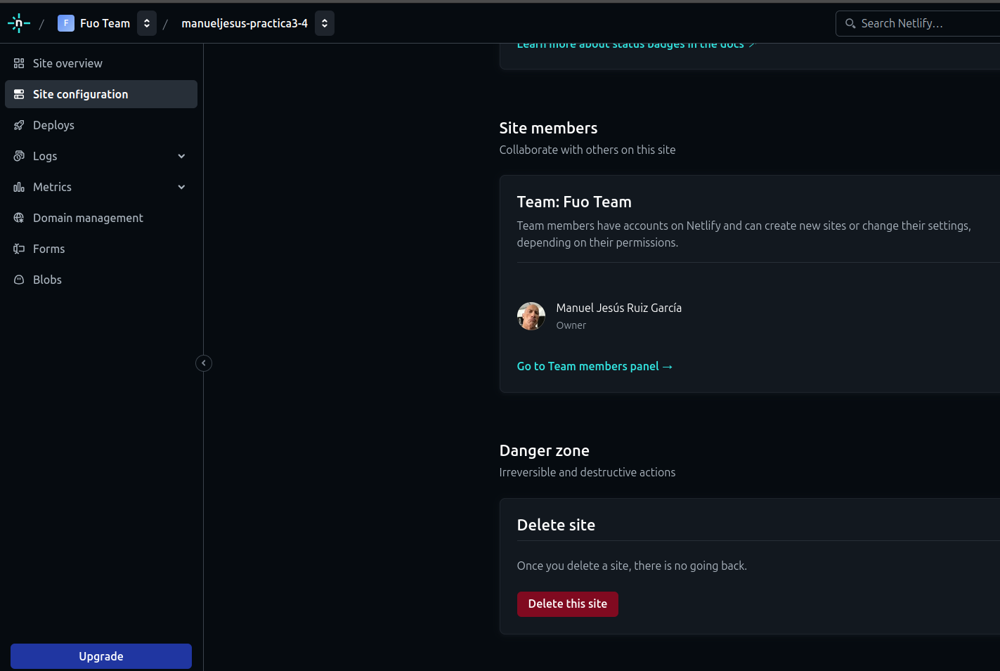

Tras esto para confirmar la eliminación escribimos el nombre del sitio y clickamos sobre `Delete`.

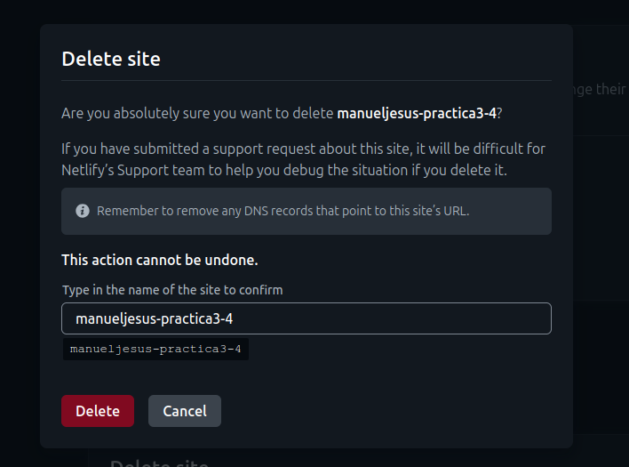

#### Crear repositorio en Github con la app

Para desplegar la aplicación, descargaremos el código fuente sin repositorio usando el comando:
```bash
wget https://github.com/StackAbuse/color-shades-generator/archive/refs/heads/main.zip
```

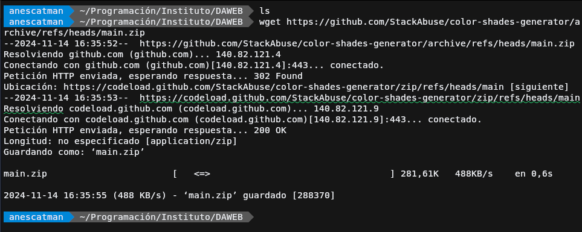

Extraemos el zip en la carpeta que mejor nos venga

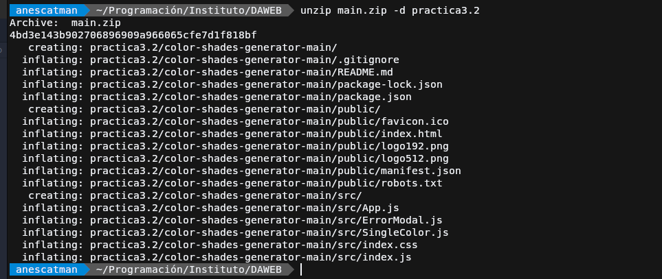

Ahora para crear el repositorio local simplemente debemos de usar el comango `git init` para que cree todo lo necesario
para el control de versiones. Tras esto debemos de añadir todos los archivos al primer commit, esto se hará con `git add .` y con
`git commit -m "mensaje commit"` creamos el commit.

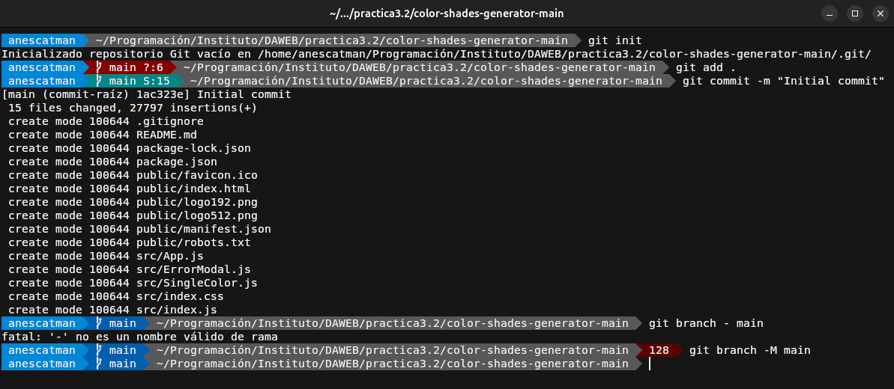

Ahora para subir los archivos al repositorio remoto, debemos de añadir este usando el comando `git remote add <nombre_origen> <url_repo>`.
Algo a tener en cuenta es que el nombre del origen puede ser el que quieras, pero generalmente se suele usar `origin`.

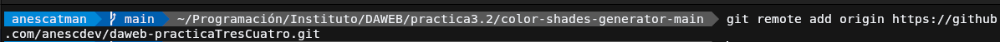

Ahora solo queda subir los cambios al repositorio remoto, este ya fue creado anteriormente en github en mi cuenta, por lo que tu tendrás
que crear otro. 

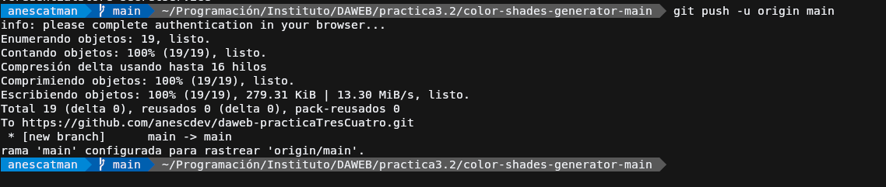

#### Crear sitio a partir de un repo de Github

Para hacer deploy desde el repositorio debemos de ir al listado de sitios y buscar el botón de `Import from Git` para después
hacer click en él.

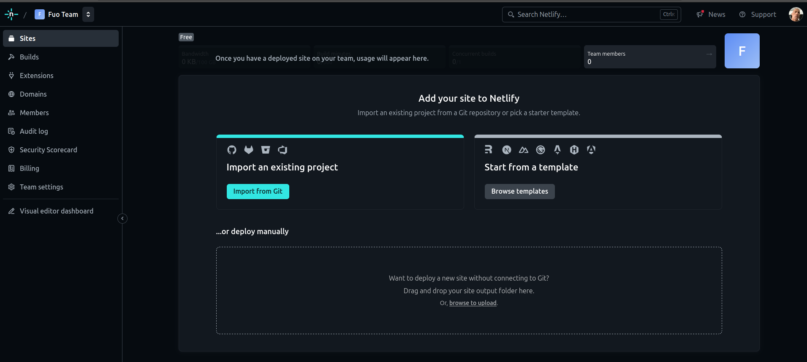

Ahora nos preguntarán que proveedor de servicio de repositorio remoto queremos usar para obtener la aplicación a desplegar,
en nuestro caso usaremos Github.

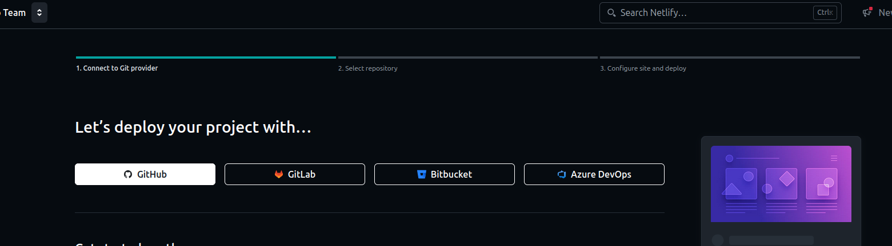

Tras elegir Github nos creará una ventana emergente donde nos preguntará donde queremos instalar la aplicacion de Netlify, en nuestro
caso elegiremos nuestra cuenta personal en vez de alguna organización ya existente.

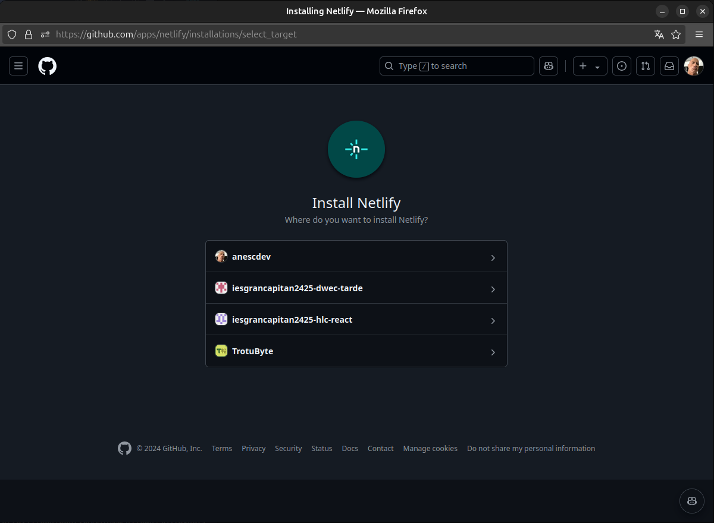

Ahora tenemos que elegir a que repositorios tendrá acceso Netlify, por cuestiones de privacidad, solo voy a darle acceso al repositorio
que creé exclusivamente para la práctica, una vez elegido le damos al botón de `Install` y nos mostrará un mensaje una vez termine de que
ya podemos cerrar la ventana.

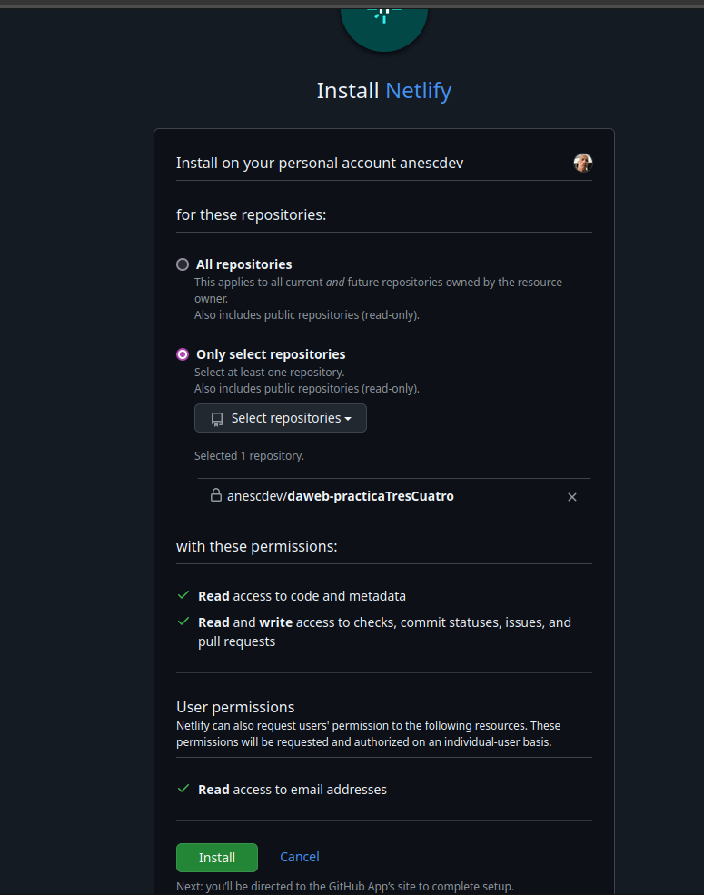

Ahora ya podremos elegirlo dentro del panel de Netlify, por lo que lo elegimos.

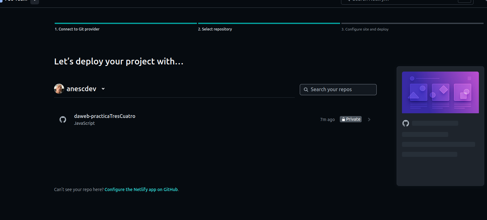

Ahora para configurar el sitio simplemente para este despliegue sencillo debemos de indicar los siguientes datos:

1. El equipo de Netlify del sitio.
2. El nombre del sitio.
3. La rama que va a desplegar
4. El comando de construcción
5. El directorio de la aplicación construida.

Ahora le damos al botón de `Desplegar`

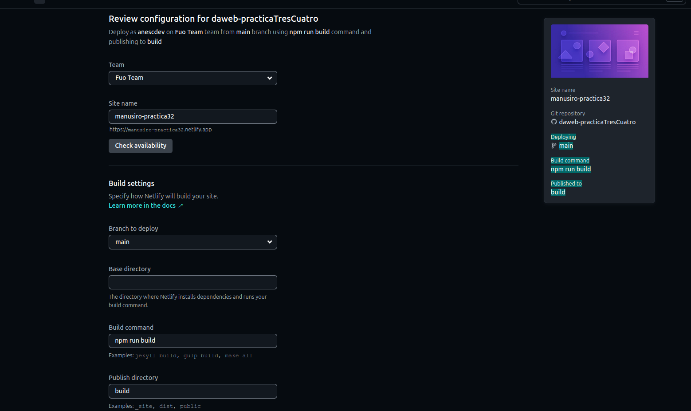

Una vez hemos presionado sobre ese botón en los sitios nos mostrará algo parecido a la siguiente captura, indicándonos que se está desplegando
que si el proyecto es ligero, con darle unos minutos ya se pondrá como en la última captura de pantalla y ya podremos acceder mediante la URL
que nos proporciona Netlify.

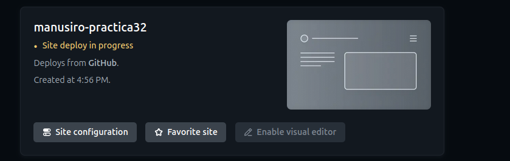

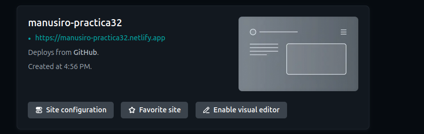