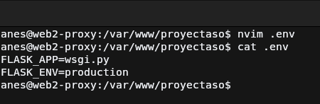
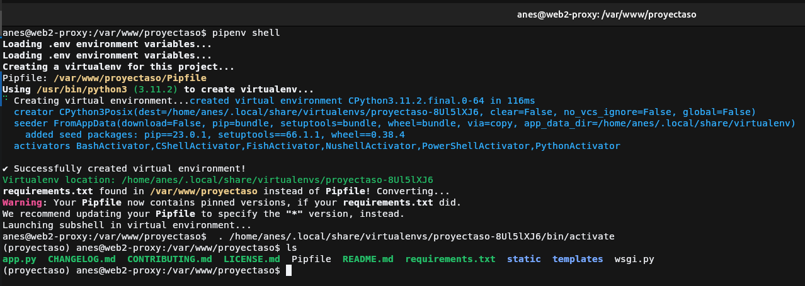
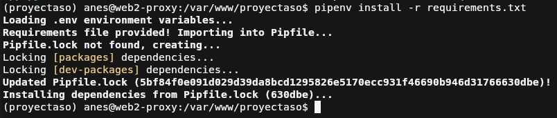
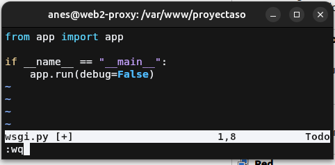
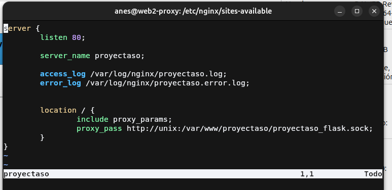
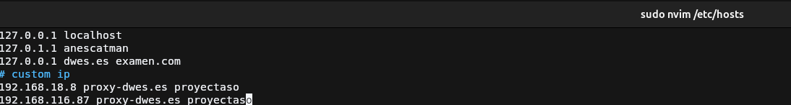
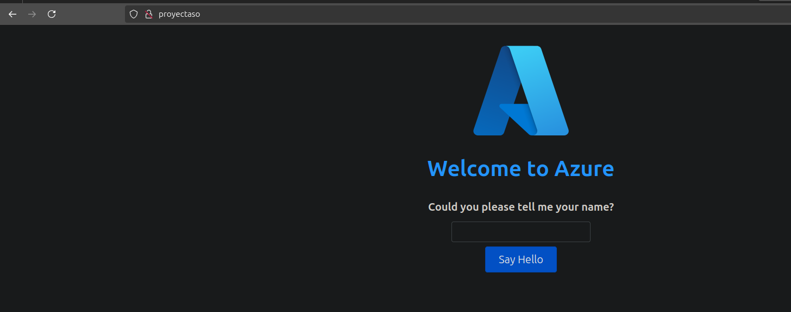

# Práctica 3.3: Despliegue de una aplicación Flask (Python)

!!! danger "Cuidao"
    Falta documentar

## Inicialización y despliegue básico de aplicación
### Instalación de pipenv

### Inicialización de aplicación

### Creación de archivo de wsgi

### Prueba de funcionamiento

## Servicio Gunicorn con Systemd

### Prueba de funcionamiento de Gunicorn

### Obtención de ruta del ejecutable de gunicorn

/home/anes/.local/share/virtualenvs/proyectaso-8Ul5lXJ6/bin/gunicorn
### Creación de servicio Systemd

## Creación host en Nginx

## Cuestiones
!!! question "Cuestión 1"
    Busca, lee, entiende y explica qué es y para que sirve un servidor WSGI

