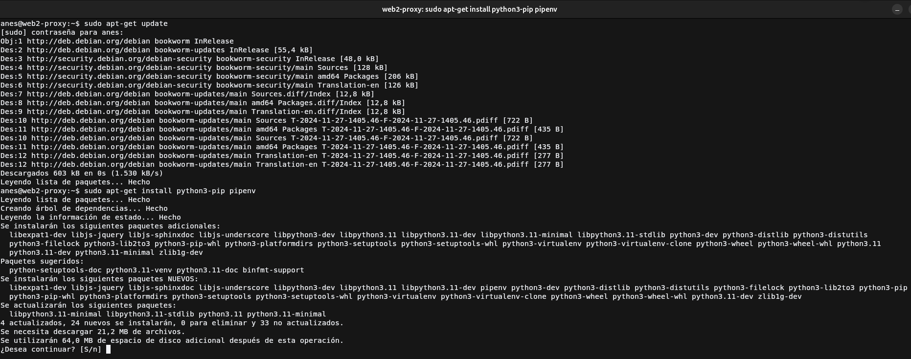
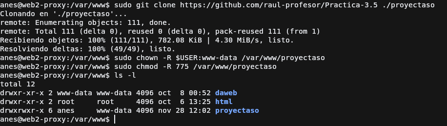
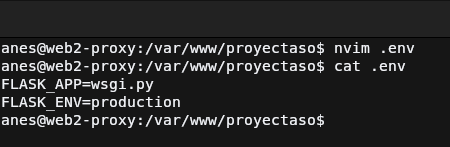
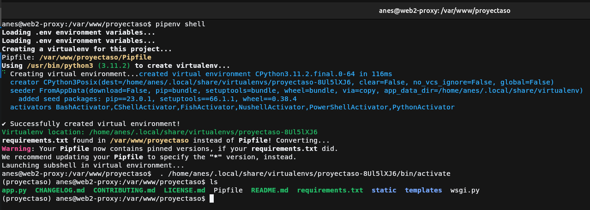
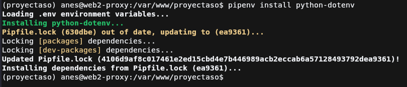
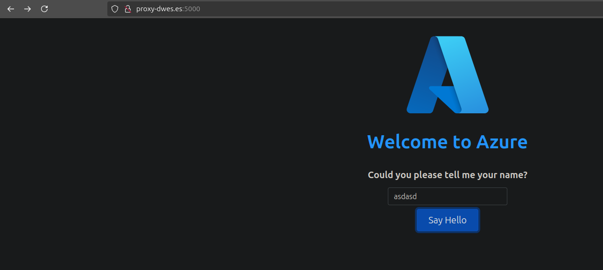
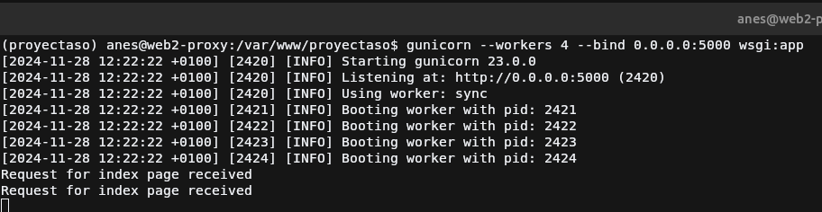
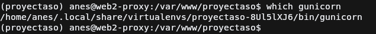
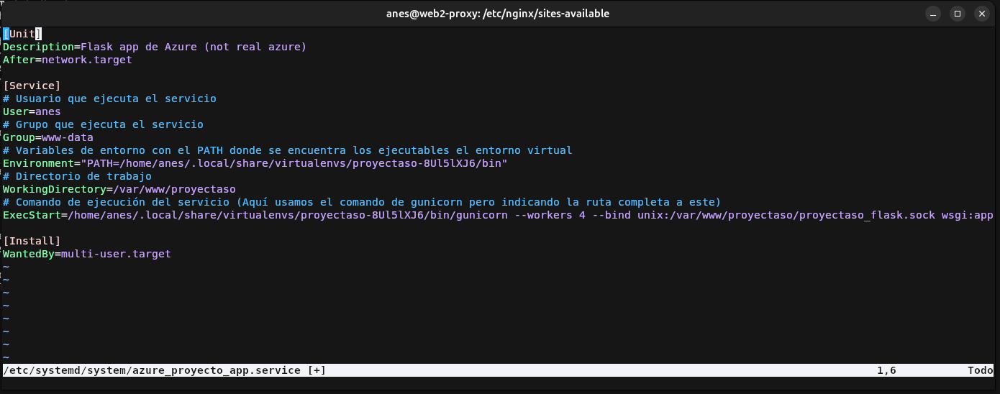

# Práctica 3.3: Despliegue de una aplicación Flask (Python)

!!! danger "Cuidao"
    Falta documentar

## Inicialización y despliegue básico de aplicación
### Instalación de pipenv

### Inicialización de aplicación

### Creación de archivo de wsgi

### Prueba de funcionamiento

## Servicio Gunicorn con Systemd

### Prueba de funcionamiento de Gunicorn

### Obtención de ruta del ejecutable de gunicorn

### Creación de servicio Systemd

## Creación host en Nginx

## Cuestiones
!!! question "Cuestión 1"
    Busca, lee, entiende y explica qué es y para que sirve un servidor WSGI

    Un servidor WSGI es un intermediario entre el servidor web y el servidor de aplicaciones. Es un estándar que permite
    facilitar el unir un servidor web a uno o varios de aplicaciones destinado a Python. Las peticiones que le llegan al servidor web
    este las pasa al servidor WSGI y el servidor WSGI las pasa a la aplicación correspondiente, o la instancia de esta ya que si lo permite 
    puedes tener varias instancias de una misma aplicación funcionando, actuando de balanceador de carga, como Gunicorn