# Práctica 4.1: Configuración de un servidor DNS
!!! warning "Sobre las IPs"
    En la práctica puede verse en las capturas que cambia la dirección de red a partir de cierto punto. Esto es debido a que en clase no tiene la misma dirección de red que la de mi casa.
## Introducción
En esta práctica se va a realizar la instalación y configuración del servidor de nombres Bind9. 

Este tipo de servidores se encargan de resolver los nombres de host 
de las URL y es un paso intermedio que aunque invisible al usuario hace una labor importante ya que permite tener direcciones URL con nombres más fáciles de recordar que la dirección a la máquina. 

Para que entendamos un poco el funcionamiento de este servidor podemos asemejarlo a un índice de un libro, en el que tienes el nombre del capítulo y en la página en la que se encuentra para que el lector pueda saber a qué pagina dirigirse, pues ese es el funcionamiento a groso modo de este tipo de servidor.

## Instalación de Bind9
Para instalar Bind9 en Debian 12, usaremos el gestor de paquetes del sistema ya 
que este lo proporciona, por lo que el comando a usar es:

``` bash
sudo apt-get install bind9 bind9utils bind9-doc
```


Puesto que para la práctica y para el servidor de pruebas, la IPV6 no nos va a hacer ninguna
falta, podemos deshabilitarla cambiando los parámetros de inicio que tendrá el servicio
`named`, que es el nombre que recibe el servidor Bind9.

Nos dirigiremos al archivo `/etc/default/named` y en la variable `OPTIONS` tendremos que añadir
el parámetro `-4` al final, tal y como se muestra en la captura.

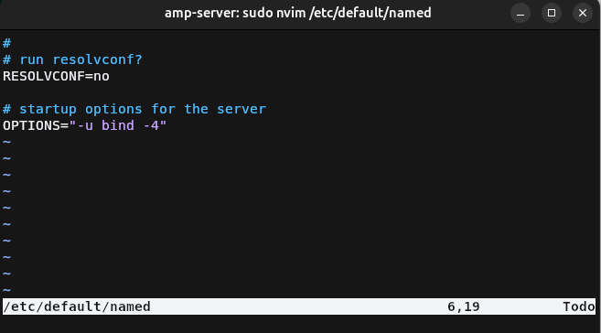

## Archivo de agrupación de configuración
Este archivo se encarga de agrupar los tres archivos de configuración principales del
servidor Bind9, este generalmente no hay que tocarlo para nada ya que solo se encarga
de incluir los diferentes archivos de configuración los cuales son: 

* `named.conf.options`: Archivo donde se agrupan las opciones generales del servidor Bind9.
* `named.conf.local`: Archivo donde se definen las zonas del servidor Bind9.
* `named.conf.default-zones`: Este archivo contiene las zonas por defecto del servidor Bind9. Estas zonas son las del localhost, y la de broadcast, este no lo tocaremos en esta práctica.

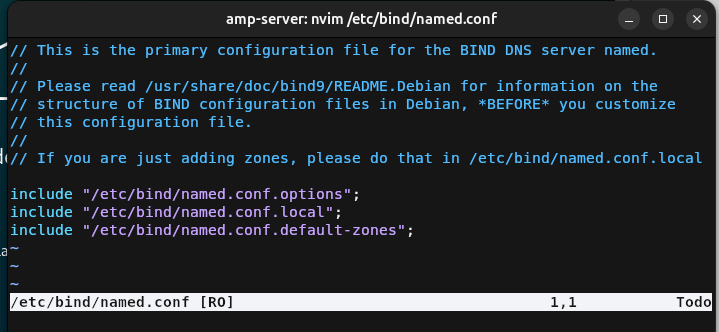

## Configuración general
Antes de definir las zonas, tendremos que realizar ciertas modificaciones en el archivo de configuración general.

### Copia de seguridad
Cuando se modifican archivos de configuración generalmente se recomienda guardar una copia de seguridad de la última configuración que funciona por si tenemos que volver para atrás,
esto se logra ejecutando el siguiente comando:
``` bash
sudo cp /etc/bind/named.conf.options /etc/bind/named.conf.options.backup
```

### Lista blanca de peticiones
Para esta práctica vamos a añadir una lista blanca de las redes que pueden preguntar al servidor de nombres, esto se logra mediante el bloque `acl` en el que deberemos de añadir
la dirección de red de las redes permitidas junto a su máscara de red abreviada. El formato del bloque es:
``` conf
acl "<nombreAcl>" {
    <byte>.<byte>.<byte>.<byte>/<mascara>;
    //...
};
```
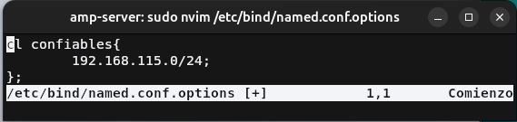
!!! info "Direcciones de red"
    Las direcciones de red se obtiene poniendo los bits de host a 0. 
    
    Es decir que para la ip `192.168.115.43/24` la ip de red sería `192.168.115.0/24` ya que el último octeto corresponde a los bits de hosts.

### Configuración del servidor

La configuración que vamos a hacer extra es la siguiente: 

* Primero desactivamos que escuche peticiones con IPV6, aunque ya se desactivó anteriormente también debemos de hacerlo aquí.
* Indicamos que solo las redes de la lista blanca pueden hacer consultas recursivas a otros DNS para resolver el nombre. Ojo que aquí no las permitimos aún, solo indicamos quienes pueden hacerlas
* Indicamos que ningún equipo que haga una petición a nuestra DNS pueda ser transferido a otra zona de la que accede primeramente.
* Indicamos que el servidor Bind9 escucha en el puerto e ip indicado.
* Permitimos las consultas recursivas en Bind9


## Creación de las zonas DNS
Ahora vamos a definir las zonas directas e inversas para resolver el nombre de dominio que se añada a este.

Tenemos la zona directa que resuelve de nombre a IP y la zona inversa que resuelve de IP a nombre.

Para ir al grano en las configuración vamos a explicar los registros necesarios para definir una zona:

*   Registro `SOA`(Start Of Authority): Se encarga de almacenar información sobre la zona DNS, tales como la dirección de
    administrador de la zona, el tiempo de espera entre actualizaciones, etc. Este registro es obligatorio para cumplir con
    las normas IETF y para realizar transferencias de zonas correctamente, aunque en esta práctica las deshabilitemos.

    Este registro sigue el siguiente formato `@ IN SOA <servidor de nombres> <direccion del administrador> (...)` en donde
    los puntos suspensivos se indican mediante espacios o saltos de línea la configuración de la zona DNS, el orden es 
    importante ya que equivale a los siguiente:

    * Número serial: Número que cuando cambia, indica a los servidores DNS secundarios que deben actualizar su copia del archivo de la zona DNS específica.
    * Refresco (REFRESH): El tiempo de espera (en segundos) que los servidores DNS secundarios pidan el registro SOA a la zona para comprobar si se ha actualizado.
    * Reintento (RETRY): El tiempo de espera (en segundos) que los servidores DNS secundarios tienen que esperar para pedir el registro SOA en caso de que no responda el servidor de la zona.
    * Expiración (EXPIRE): Tiempo de espera (en segundos) en el que el servidor secundario si no recibe respuesta, no responderá a las peticiones de la zona.
    * TTL: Tiempo (en segundos) en el que los servidores tendrán que cachear los registros.

*   Registro `NS`(Names Server): Este es más sencillo que el anterior, este indica que servidor contiene los registros DNS
    de la zona y nunca deberan de apuntar a un registro `CNAME`. La sintáxis es `@ IN NS <servidor dns>`.

Una vez explicado esto ya podemos continuar con la práctica, adelantando que estos dos registros siempre deberan de incluirse
al principio de cada zona.

### Zona DNS principal
#### Definición de la zona
Para definir las zonas nos dirigimos al archivo `named.conf.local`, y en dicho archivo debemos de usar el bloque
`zone{...};` para definir las diferentes zonas. La sintáxis es la siguiente:
``` conf
zone "<nombre zona>" {
    type master;
    file "<ruta_archivo_zona>";
}
```

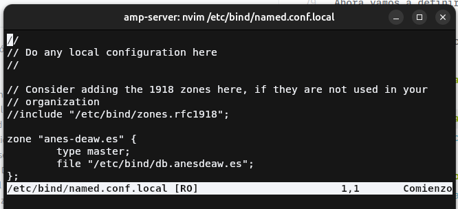

#### Archivo de la zona
Añadimos los correspondientes registros `SOA`, `NS` y un nuevo registro de tipo `A`. Este indica que el subdominio `debian`
hará referencia a la IP que le indiquemos, siendo su sintáxis de la siguiente manera: `<subdominio> IN A <ip`>`.
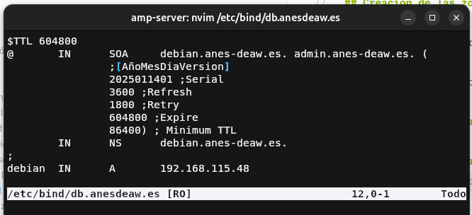

### Zona DNS inversa
#### Definición de la zona inversa
Para definir la zona inversa debemos de usar una sintáxis especial para indicar al servidor DNS que esa zona será para
resolver inversamente de IP a nombre de dominio. 

El nombre de la zona es `<direccion de red sin los octetos de host>.in-addr.arpa`. Por lo demás es igual a crear una zona normal.
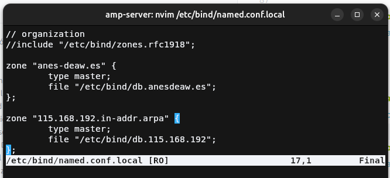

#### Archivo de la zona inversa
Añadimos los correspondientes registros `SOA`, `NS` y un nuevo registro de tipo `PTR`.

Este tipo de registro es el contrario al tipo `A`, es decir vincula una IP con un nombre. Bien esta IP tiene que coincidir los bytes de red 
con el nombre puesto a la zona DNS inversa, para que podamos abreviar este registro y solo escribir el último octeto de red.
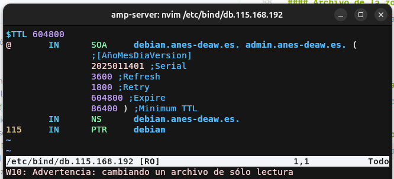

!!! warning "Sobre la configuración"
    Mientras realizaba la tarea, me dió por investigar y una [guía](https://www.apnic.net/about-apnic/corporate-documents/documents/resource-guidelines/reverse-zones/) indica que en el registro por ejemplo no se pone el tercer
    octeto de red sino el último de toda la IP. No lo he probado ya que siguiendo la práctica funcionó todo correctamente.

## Comprobación del funcionamiento del DNS
### Comprobamos configuración

Para comprobar que todo funciona correctamente tenemos que ejecutar los dos siguientes comandos, fijándonos si en las salidas
de estos nos devuelven un OK. En caso contrario nos indicará que tenemos mal aunque a veces puede ser un poco confuso el
mensaje.

``` bash
# Comprobar la zona directa
sudo named-checkconf <archivo de la zona> <archivo de la zona inversa>
# Comprobar la zona inversa
sudo named-checkconf <archivo de la zona inversa> <archivo de la zona>
```
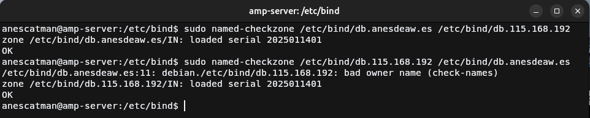

Una vez tenemos `OK` en las dos zonas, podemos reiniciar el servicio de Bind9 para aplicar los cambios, esto se hace
con el siguiente comando:
``` bash
sudo systemctl restart named
```

En caso de que queramos comprobar si todo ha sido cargado correctamente, usamos el siguiente:
``` bash
sudo systemctl status named
```

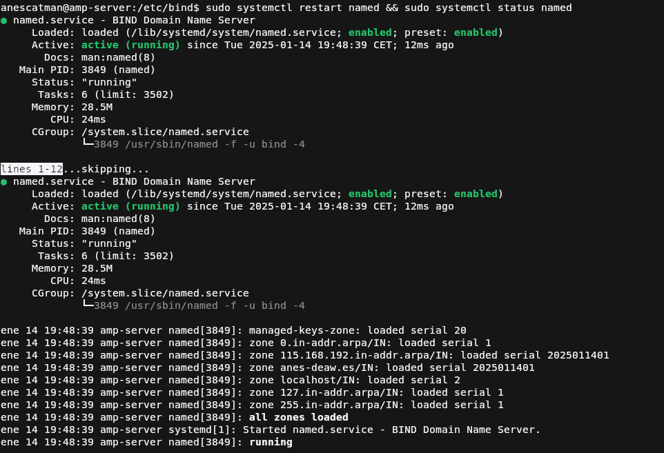

### Comprobamos las resoluciones de nombre con dig

Para comprobar que todo funciona correctamente primeramente debemos de configurar nuestro sistema para añadir el
servidor DNS para que pregunte a este además del por defecto, en mi caso con Ubuntu sería en la configuración de 
la red conectada.

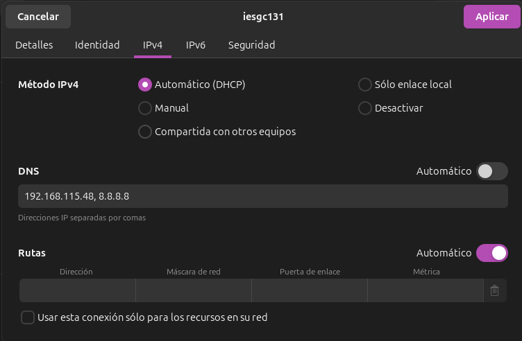

Ahora para ver si nos resuelve correctamente el nombre, debemos de usar el comando:
``` bash
dig <subdominio o dominio>
```

Y nos tiene que devolver que en el partado de `QUESTION` pedimos el registro de tipo `A` con esa ip para que después
en el apartado `ANSWER` nos indique la misma cabecera pero con la IP del registro. Tal y como se ve en la captura.


!!! danger "Arreglo"
    La zona inversa no devuelve el nombre de la IP

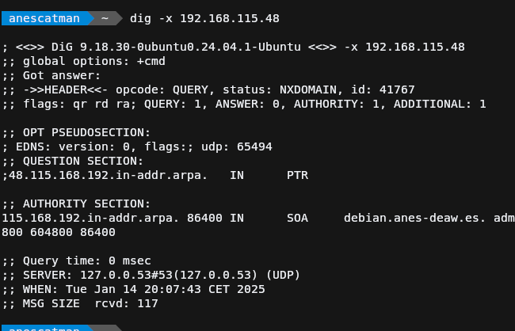
## Tarea
Configura el DNS para que resuelva el nombre de vuestro sitio web de la práctica 3.5 y de la 3.2.

Recuerda que con nuestra configuración actual, para acceder a los sitios web necesitaremos añadir el dominio deaw.es en el nombre.

!!! warning "Aviso"
    Debido a que tuve un problema con las máquina virtuales, voy a usar unas nuevas que cree estas vacaciones de navidad.
## Cuestiones
!!! task "Cuestión 1"
    ¿Qué pasará si un cliente de una red diferente a la tuya intenta hacer uso de tu DNS de alguna manera, le funcionará?¿Por qué, en qué parte de la configuración puede verse?
!!! task "Cuestión 2"
    ¿Por qué tenemos que permitir las consultas recursivas en la configuración?
!!! task "Cuestión 3"
    El servidor DNS que acabáis de montar, ¿es autoritativo?¿Por qué?
!!! task "Cuestión 4"
    ¿Dónde podemos encontrar la directiva $ORIGIN y para qué sirve?
!!! task "Cuestión 5"
    ¿Una zona es idéntico a un dominio? 
!!! task "Cuestión 6"
    ¿Pueden editarse los archivos de zona de un servidor esclavo/secundario?
!!! task "Cuestión 7"
    ¿Por qué podría querer tener más de un servidor esclavo para una misma zona?
!!! task "Cuestión 8"
    ¿Cuántos servidores raíz existen?
!!! task "Cuestión 9"
    ¿Qué es una consulta iterativa de referencia?
!!! task "Cuestión 10"
    En una resolución inversa, ¿a qué nombre se mapearía la dirección IP 172.16.34.56?