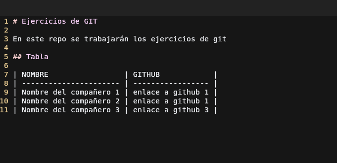
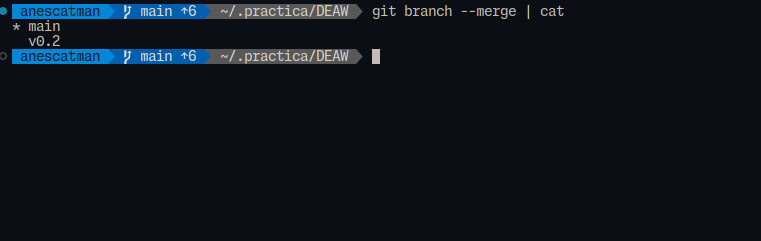
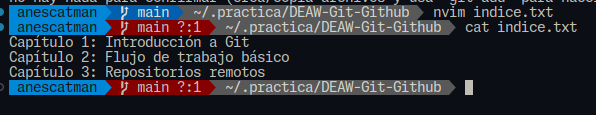
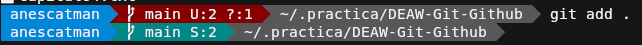

# Práctica 5.1: Ejercicios de Git

## Ejercicios (I)
### Ejercicio 1
#### Creación del repositorio


#### Readme


#### Commit inicial


#### Push inicial


#### Ignorar archivos


#### Añadir fichero 1.txt


#### Crear el tag v0.1


#### Subir el tag v0.1


#### Cuenta de GitHub
##### Poner una foto en vuestro perfil de GitHub.


##### Poner el doble factor de autentificación en vuestra cuenta de GitHub.


#### Uso social de GitHub
##### Preguntar los nombres de usuario de GitHub de 2 de tus compañeros de clase, búscalos, y sigueles.


##### Seguir los repositorios DEAW del resto de tus compañeros.


##### Añadir una estrella a los repositorios DEAW del resto de tus compañeros.


#### Crear una tabla


#### Colaboradores
Añadir a https://github.com/dlopezmfp como colaborador


### Ejercicio 2
#### Crear una rama v0.2


#### Añadir fichero 2.txt


#### Crear rama remota v0.2


#### Merge directo
##### Parte 1


##### Parte 2


#### Merge con conflicto
##### Parte 1
En la rama *master* poner *Hola* en el fichero *1.txt* y hacer commit


##### Parte 2
Posicionarse en la rama *v0.2* y poner *Adios* en el fichero "1.txt" y hacer commit.


##### Parte 3
Posicionarse de nuevo en la rama *master* y hacer un merge con la rama *v0.2*


#### Listado de ramas


##### Ramas con merge



##### Ramas sin merge


#### Arreglar conflicto
```
<<<<<<<<
Hola
============
Adios
>>>>>>>>
```


#### Borrar rama
##### Crea un tag v0.2


##### Borrar rama v0.2


#### Listado de cambios


## Ejercicios (II)
### Creación y actualización de repostorios
#### Ejercicio 1
Configurar Git definiendo el nombre del usuario, el correo electrónico y activar el coloreado de la salida.
Mostrar la configuración final.


#### Ejercicio 2
Crear un repositorio nuevo con el nombre libro y mostrar su contenido.


#### Ejercicio 3

Comprobar el estado del repositorio.


Crear un fichero indice.txt con el siguiente contenido:

```
Capítulo 1: Introducción a Git
Capítulo 2: Flujo de trabajo básico
Capítulo 3: Repositorios remotos
```


Comprobar de nuevo el estado del repositorio.


Añadir el fichero a la zona de intercambio temporal.


Volver a comprobar una vez más el estado del repositorio.


#### Ejercicio 4
Realizar un commit de los últimos cambios con el mensaje “Añadido índice del libro.” y ver el estado del repositorio.


#### Ejercicio 5
Cambiar el fichero indice.txt para que contenga lo siguiente:
```
Capítulo 1: Introducción a Git
Capítulo 2: Flujo de trabajo básico
Capítulo 3: Gestión de ramas
Capítulo 4: Repositorios remotos
```


Mostrar los cambios con respecto a la última versión guardada en el repositorio.


Hacer un commit de los cambios con el mensaje “Añadido capítulo 3 sobre gestión de ramas”.


Sobra el comando git diff aquí, es para comprobar

#### Ejercicio 6
Mostrar los cambios de la última versión del repositorio con respecto a la anterior.


Cambiar el mensaje del último commit por “Añadido capítulo 3 sobre gestión de ramas al índice.”


Volver a mostrar los últimos cambios del repositorio.


### Manejo del historial de cambios
#### Ejercicio 1

**Mostrar el historial de cambios del repositorio.**


**Crear la carpeta capitulos y crear dentro de ella el fichero capitulo1.txt con el siguiente texto.**

`Git es un sistema de control de versiones ideado por Linus Torvalds.`
Git es un sistema de control de versiones ideado por Linus Torvalds.


**Añadir los cambios a la zona de intercambio temporal.**


**Hacer un commit de los cambios con el mensaje _“Añadido capítulo 1.”_ Volver a mostrar el historial de cambios del repositorio.**


#### Ejercicio 2
**Crear el fichero `capitulo2.txt` en la carpeta capitulos con el siguiente texto.**

`El flujo de trabajo básico con Git consiste en: 1- Hacer cambios en el repositorio. 2- Añadir los cambios a la zona de intercambio temporal. 3- Hacer un commit de los cambios.`


**Añadir los cambios a la zona de intercambio temporal.**


**Hacer un commit de los cambios con el mensaje _“Añadido capítulo 2.”_**


**Mostrar las diferencias entre la última versión y dos versiones anteriores.**

#### Ejercicio 3
**Crear el fichero capitulo3.txt en la carpeta capitulos con el siguiente texto.**

`Git permite la creación de ramas lo que permite tener distintas versiones del mismo proyecto y trabajar de manera simultanea en ellas.`

**Añadir los cambios a la zona de intercambio temporal.**

**Hacer un commit de los cambios con el mensaje _“Añadido capítulo 3.”_**

**Mostrar las diferencias entre la primera y la última versión del repositorio.**

#### Ejercicio 4
**Añadir al final del fichero `indice.txt` la siguiente línea:**

`Capítulo 5: Conceptos avanzados`

**Añadir los cambios a la zona de intercambio temporal.**

**Hacer un commit de los cambios con el mensaje “Añadido capítulo 5 al índice.”.**

**Mostrar quién ha hecho cambios sobre el fichero `indice.txt`.**

### Deshacer cambios
#### Ejercicio 1

**Eliminar la última línea del fichero `indice.txt` y guardarlo.**


**Comprobar el estado del repositorio.**


**Deshacer los cambios realizados en el fichero `indice.txt` para volver a la versión anterior del fichero.**


**Volver a comprobar el estado del repositorio.**


#### Ejercicio 2
**Eliminar la última línea del fichero `indice.txt` y guardarlo.**


**Añadir los cambios a la zona de intercambio temporal.**


**Comprobar de nuevo el estado del repositorio.**


**Quitar los cambios de la zona de intercambio temporal, pero mantenerlos en el directorio de trabajo.**


**Comprobar de nuevo el estado del repositorio.**


**Deshacer los cambios realizados en el fichero `indice.txt` para volver a la versión anterior del fichero.**


**Volver a comprobar el estado del repositorio.**


#### Ejercicio 3
**Eliminar la última línea del fichero `indice.txt` y guardarlo.**


**Eliminar el fichero `capitulos/capitulo3.txt`.**


**Añadir un fichero nuevo `capitulos/capitulo4.txt` vacío.**


**Añadir los cambios a la zona de intercambio temporal.**


**Comprobar de nuevo el estado del repositorio.**


**Quitar los cambios de la zona de intercambio temporal, pero mantenerlos en el directorio de trabajo.**


**Comprobar de nuevo el estado del repositorio.**


**Deshacer los cambios realizados para volver a la versión del repositorio.**


**Volver a comprobar el estado del repositorio.**


Algo a tener en cuenta es que el fichero no lo elimina debido a que es un archivo nuevo, para solucionar esto simplemente
usamos el comando `git clean`, junto a los parámetros: 

* `-f`: fuerza el borrado, obligatorio por defecto.
* `-d`: muestra que archivos va a borrar, recomendado ejecutar el comando antes con -d para comprobar que borrará y después ejecutarlo sin este para borrar los archivos si nos interesa.


#### Ejercicio 4
**Eliminar la última línea del fichero `indice.txt` y guardarlo.**


**Eliminar el fichero `capitulos/capitulo3.txt`.**


**Añadir los cambios a la zona de intercambio temporal y hacer un commit con el mensaje _“Borrado accidental.”_**


**Comprobar el historial del repositorio.**

Se comprueba el historial usando `git log`.


**Deshacer el último commit pero mantener los cambios anteriores en el directorio de trabajo y la zona de intercambio temporal.**

Para esto debemos obtener el hash del cambio que queremos revertir, usando el comando anterior, tras eso lo copiamos y lo pegamos en el argumento del comando `git revert`
El parámetro `-n` en el comando `git revert` permite revertir un commit sin que se haga automáticamente un commit nuevo con los archivos revertidos.


**Comprobar el historial y el estado del repositorio.**


**Volver a hacer el commit con el mismo mensaje de antes.**


**Deshacer el último commit y los cambios anteriores del directorio de trabajo volviendo a la versión anterior del repositorio.**


**Comprobar de nuevo el historial y el estado del repositorio.**


### Gestión de ramas
#### Ejercicio 1
**Crear una nueva rama bibliografia y mostrar las ramas del repositorio.**

#### Ejercicio 2
**Crear el fichero capitulos/capitulo4.txt y añadir el texto siguiente**

**En este capítulo veremos cómo usar GitHub para alojar repositorios en remoto.**

**Añadir los cambios a la zona de intercambio temporal.**

**Hacer un commit con el mensaje _“Añadido capítulo 4.”_**

**Mostrar la historia del repositorio incluyendo todas las ramas.**

#### Ejercicio 3
**Cambiar a la rama bibliografia.**

**Crear el fichero bibliografia.txt y añadir la siguiente referencia**

`Chacon, S. and Straub, B. Pro Git. Apress.`

**Añadir los cambios a la zona de intercambio temporal.**

**Hacer un commit con el mensaje _“Añadida primera referencia bibliográfica.”_**

**Mostrar la historia del repositorio incluyendo todas las ramas.**

#### Ejercicio 4
**Fusionar la rama bibliografia con la rama master.**

**Mostrar la historia del repositorio incluyendo todas las ramas.**

**Eliminar la rama bibliografia.**

**Mostrar de nuevo la historia del repositorio incluyendo todas las ramas.**

#### Ejercicio 5
**Crear la rama bibliografia.**

**Cambiar a la rama bibliografia.**

**Cambiar el fichero `bibliografia.txt` para que contenga las siguientes referencias:**

```
Scott Chacon and Ben Straub. Pro Git. Apress.
Ryan Hodson. Ry’s Git Tutorial. Smashwords (2014)
```

**Añadir los cambios a la zona de intercambio temporal y hacer un commit con el mensaje _“Añadida nueva referencia bibliográfica.”_**

**Cambiar a la rama master.**

**Cambiar el fichero `bibliografia.txt` para que contenga las siguientes referencias:**

```
Chacon, S. and Straub, B. Pro Git. Apress.
Loeliger, J. and McCullough, M. Version control with Git. O’Reilly.
```

**Añadir los cambios a la zona de intercambio temporal y hacer un commit con el mensaje _“Añadida nueva referencia bibliográfica.”_**

**Fusionar la rama bibliografia con la rama master.**

**Resolver el conflicto dejando el fichero `bibliografia.txt` con las referencias:**

```
Chacon, S. and Straub, B. Pro Git. Apress.
Loeliger, J. and McCullough, M. Version control with Git. O’Reilly.
Hodson, R. Ry’s Git Tutorial. Smashwords (2014)
```

**Añadir los cambios a la zona de intercambio temporal y hacer un commit con el mensaje _“Resuelto conflicto de bibliografía.”_**

**Mostrar la historia del repositorio incluyendo todas las ramas.**

### Repositorios remotos

