# Práctica 6.1: Dockerización del despliegue de una aplicación con NodeJS

## Instalación de Docker

Docker en algunos sistemas no está añadido por defecto los paquetes para instalarlo y actualizarlo con el gestor del paquetes, por lo que tenemos dos
formas de instalarlo:

1. Descargando el paquete correspondiente desde la [web](https://docs.docker.com/get-started/get-docker/)
2. Añadiendo los repositorios al sistema

Yo lo haré añadiendo los repositorios al sistema

### Añadir el repositorio de Docker

Para esto podemos ejecutar los siguientes comandos uno a uno o crear un script de shell para ejecutarlo todo más sencillo, eso es lo que haré yo ya que
son bastantes comandos y teniendo la oportunidad de poder hacerlo todo de una, lo prefiero. El script que he usado es el que viene en la guía de instalación de Docker:

```sh title="add_docker_repo.sh"
# Add Docker's official GPG key:
sudo apt-get update
sudo apt-get install ca-certificates curl
sudo install -m 0755 -d /etc/apt/keyrings
sudo curl -fsSL https://download.docker.com/linux/debian/gpg -o /etc/apt/keyrings/docker.asc
sudo chmod a+r /etc/apt/keyrings/docker.asc

# Add the repository to Apt sources:
echo \
  "deb [arch=$(dpkg --print-architecture) signed-by=/etc/apt/keyrings/docker.asc] https://download.docker.com/linux/debian \
  $(. /etc/os-release && echo "$VERSION_CODENAME") stable" | \
  sudo tee /etc/apt/sources.list.d/docker.list > /dev/null
sudo apt-get update
```
Creamos un fichero con la extensión .sh y pegamos el anterior script dentro de este y lo guardamos con el nombre que querramos.
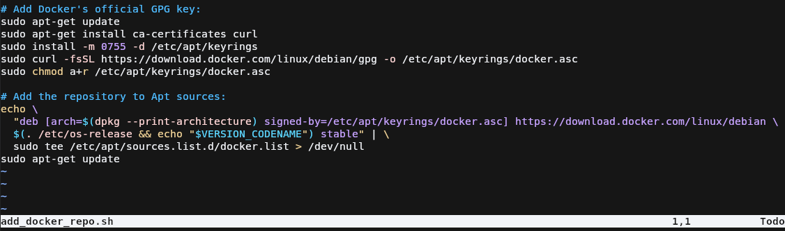

Para ejecutar el script, debemos de darle permisos de ejecución, para ello usamos el siguiente comando:
```sh
chmod +x <nombre_fichero>.sh
```

Una vez hecho esto, ejecutamos como administrador el script ya que contiene comandos que necesitan permisos elevados para realizar ciertas acciones.

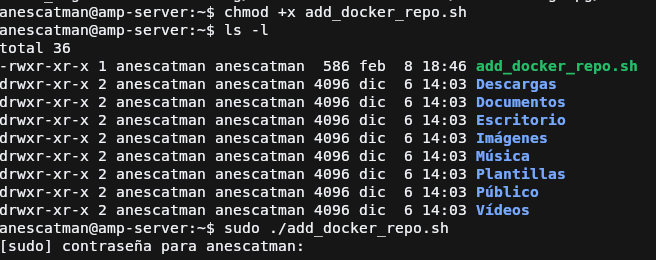

### Instalar docker

Para instalar docker usamos el gestor de paquetes del sistema, con los siguientes paquetes necesarios para docker

```sh
sudo apt-get install docker-ce docker-ce-cli containerd.io docker-buildx-plugin docker-compose-plugin
```
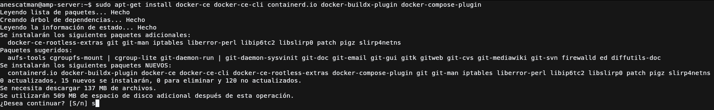

Una vez instalados debemos de hacer un paso extra y es añadir al usuario que vaya a usar docker al grupo `docker` del sistema que se habrá creado después de la instalación de los paquetes. Esto se debe de hacer porque al intentar ejecutar algún comando de docker sin estar dentro del grupo, nos 
dará un error de `Permission denied`.

```sh
sudo usermod -a -G docker <nombre_usuario>
```

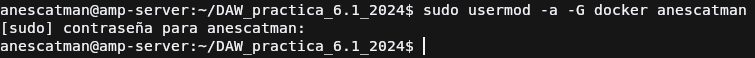

## Clonación de proyecto NodeJS

Ahora para hacer el proceso de contenerización, usaremos el proyecto de NodeJS que proporciona la práctica, por lo que usaremos `git clone` para clonar el repositorio:

```sh
git clone https://github.com/raul-profesor/DAW_practica_6.1_2024.git
```
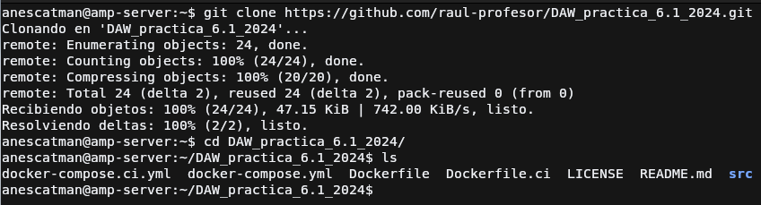

## Creación de la imagen de docker

Docker para contenerizar las aplicaciones se basan en imágenes que son un conjunto de instrucciones que seguirá docker al momento de crear las imagenes de la aplicación, dichas instrucciones son indicadas en los archivos `Dockerfile` y usa una serie de palabras clave, las cuales explicaré únicamente las usadas en el dockerfile de la captura. 

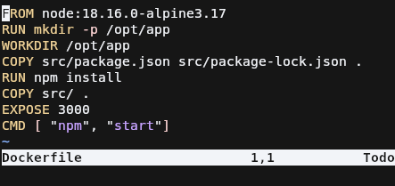

* `FROM`: Esta directiva indica desde que imagen partirá la imagen que estamos creando. Esto es debido a que necesitas una imagen de base, que puede ser desde una de un sistema operativo (mas reducido) o una aplicación que usa a la vez una imagen de un sistema operativo para funcionar. 

    En el caso de la práctica usamos una imagen de NodeJS 18 que será usada con el sistema operativo Alpine, uno muy ligero orientado a la seguridad y muy usado en contenedores.

* `RUN`: Esta directiva permite ejecutar comandos durante la creación de la imagen para hacer lo que necesitemos, en mi caso, crear una carpeta
* `WORKDIR`: Esta directiva permite cambiar el directorio de trabajo actual, es equivalente a `cd` para que lo entendamos mejor. 
* `COPY`: Esta directiva permite copiar ficheros a la imagen, desde el sistema operativo nuestro (en mi caso Ubuntu) al sistema de la imagen docker.
* `EXPOSE`: Esta directiva permite exponer un puerto para indicar a los contenedores que usen la imagen que usaran ese puerto para escuchar las peticiones. 

    Hay que tener en cuenta que esto no abre un puerto en el contenedor, hay que hacerlo explicitamente mapeandolo en el comando `docker run`

* `CMD`: Esta directiva indica que comando será ejecutado en el tiempo de ejecución del contenedor, es decir, que durante la creación de la imagen no es ejecutado.

Ahora para crear la imagen de docker, se deberá de hacer con el siguiente comando y estando en la carpeta que contiene el fichero Dockerfile.

```sh
docker build -t librodirecciones .
```

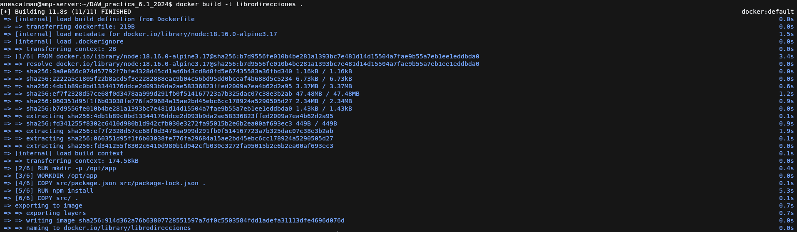

## Creación del contenedor de docker

Para crear un contenedor de docker usamos el comando `docker run`, al que le podemos indicar la imagen del contenedor. Los parámetros que usamos son los siguientes:

* `-p`: Este parámetro permite mapear un puerto de la imagen a un puerto del contenedor, sigue el siguiente formato: `<puerto_imagen>:<puerto_contenedor>`
* `--name`: nombre del contenedor para que se le pueda hacer referencia mas fácilmente mas adelante, por ejemplo para borrarlo.
* `-d`: indicamos que el contenedor será ejecutado en segundo plano tras la creación de este.

```sh
docker run -p 3000:3000 --name <nombre> -d librodirecciones
```

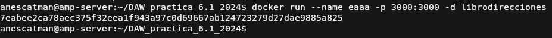

Comprobamos los logs del contenedor para ver si todo salió bien, usamos el comando `docker logs`.


Ahora probamos acceder al servidor, usando el puerto que mapeamos en el contenedor y si todo sale bien sale lo de la captura.

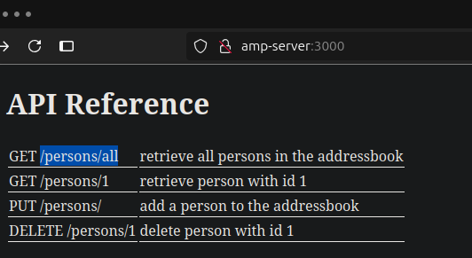

## Integrando múltiples contenedores

Cuando necesitamos usar diferentes contendores de Docker, podemos hacerlo usando `docker network` que nos permite crear redes virtuales para los contenedores
y así poder interconectar estos entre sí. Se puede hacer y es recomendable saber como funciona pero después para el momento de desplegar
contenedores unos dependientes de otros puede ser un quebradero de cabeza por lo que para esto se ha creado la utilidad **Docker Compose**.

Docker Compose se basa en un archivo YAML de configuración donde definimos los diferentes contenedores con lo que necesitemos para que funcione,
la ventaja de esto es que nos permite compartir un archivo con la configuración de todo y con esto únicamente poder desplegar las aplicaciones en diferentes
entornos diferentes de forma mucho más sencilla que usando únicamente docker. Además de poder crear contenedores que dependan de otros de forma mucho más sencilla
como es en el caso de esta aplicación.

```yaml title="docker-compose.yml"
version: "3.9"
services:
  postgres:
    image: postgres:latest
    environment:
      POSTGRES_USER: postgres
      POSTGRES_PASSWORD: postgres
    ports: 
      - '5432:5432'
    volumes:
      - addressbook-db:/var/lib/postgresql/data

  addressbook:
    build:
      context: .
    environment:
      DB_SCHEMA: postgres
      DB_USER: postgres
      DB_PASSWORD: postgres
      DB_HOST: postgres
    depends_on:
      - postgres
    ports:
      - '3000:3000'
        
volumes:
  addressbook-db:
```

Si solo queremos desplegarlo, solo nos importa que tengamos el archivo y a partir de ahi usar la utilidad `compose` que viene incorporada en Docker
desde hace unos años atrás (en versiones anteriores tenía que descargarse a parte, cosa que viene explicada en la documentación de Docker oficial).

!!! info
    Los comando de compose se recomienda ejecutarse dentro de la carpeta que contenga el fichero `docker-compose.yml` ya que ese nombre es el por 
    defecto que docker compose buscará al momento de realizar alguno. 
    
    En caso de tener varios ficheros .yml, podemos indicar a compose por medio del parámetro `-f` cual queremos usar,
    por ejemplo: `docker compose -f docker-compose.ci.yml up`.

Los comandos más usados son los siguientes:

* `docker compose up`: Permite levantar uno o todos los servicios del fichero docker-compose.yml.
* `docker compose down`: Permite eliminar uno o todos los servicios del fichero docker-compose.yml.
* `docker compose start`: Permite iniciar uno o todos los servicios del fichero docker-compose.yml.
* `docker compose stop`: Permite parar uno o todos los servicios del fichero docker-compose.yml.
* `docker compose run`: Permite ejecutar un comando dentro de un servicio específico del fichero docker-compose.yml

!!! tip 
    Para saber más a fondo puedes acceder a la [documentación](https://docs.docker.com/compose/) de docker compose.

### Crear tablas de la base de datos

Para que la aplicación que desplegamos con docker funcione, este depende de una base de datos para funcionar. Para ello la propia aplicación 
nos propociona un script para poder crear las tablas, para ello simplemente usamos el siguiente comando:

```sh
docker compose run addressbook npm run migrate
```

Esto conectará con el contenedor PostgreSQL del `docker-compose.yml` y si está levantado creará las tablas

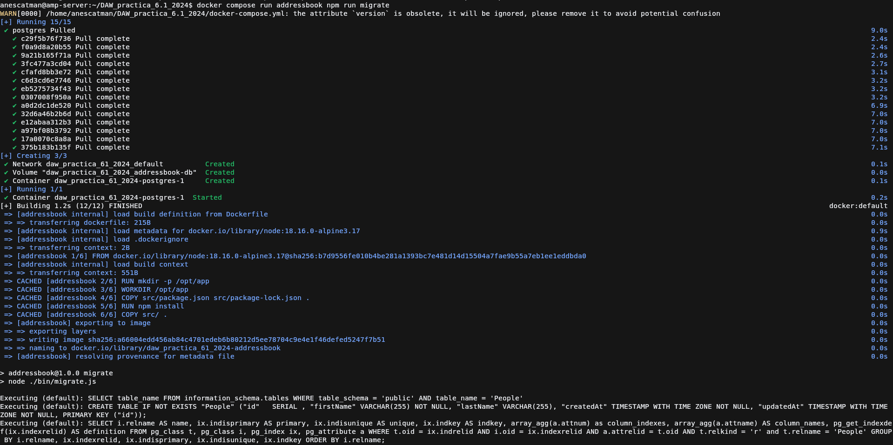

### Ejecutar tests de la aplicación
Una vez tenemos lo anterior funcionando, ya solo nos queda probar que todo funciona. Podemos desplegar la aplicación y probarla pero también podemos
usar la batería de tests que esta propociona para ver que todo funciona correctamente, para ello usamos el siguiente comando:
```sh
docker compose run addressbook npm test
```
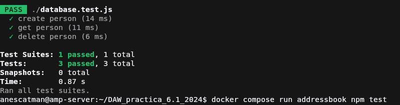

!!! warning
    Para esto debemos de tener funcionando la base de datos, lo hará de forma automática ya que tenemos definido que el servicio `addressbook` dependa
    del contendor de PostgreSQL. Quiero aclararlo por si ocurre que por alguna razón u otra no funcionan los tests

### Poner en marcha la app

Una vez hecho los pasos anteriores, desplegamos la aplicación completamente con el siguiente comando: 
```sh
docker compose up --build -d
```

Si nos fijamos, tenemos dos parámetros en el comando, esto hace que:

* `--build`: Obliga a docker compose a reconstruir (en caso de que esté creada la imagen con anterioridad, si no existe la construirá sin este parámetro) los servicios que crea contenedores a partir de un Dockerfile, como es el caso de `addressbook`.
* `-d`: Indica a docker compose que estos contendores al terminar de crearse, se ejectuarán en segundo plano, por lo que no mostrará los logs de estos, nos dejará en la terminal para que hagamos lo que necesitemos.

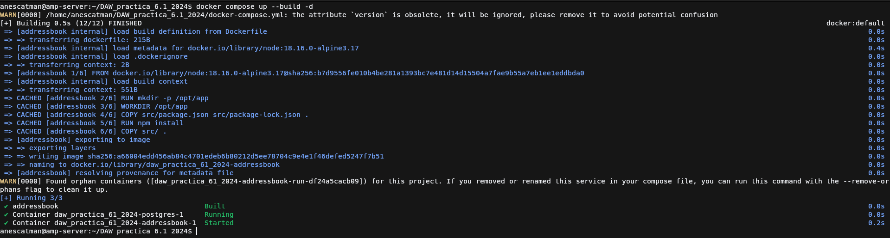


### Probando la aplicación
Probad que la aplicación junto con la BBDD funciona correctamente. El funcionamiento de la API es:

* PUT /persons/ añade una persona al libro de direcciones:
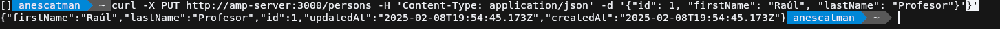
* GET /persons/all muestra todas las personas en el libro de direcciones

* GET /persons/1 muestra la persona con el id 1
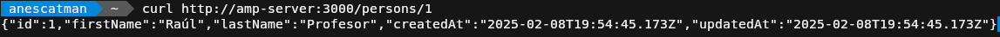
* DELETE /persons/1 elimina a la persona con el id 1
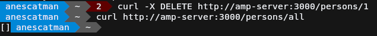
