# Práctica 6.3: Despliegue de servidores web con usuarios autenticados mediante LDAP usando Docker y docker-compose

## Despliegue con Docker Compose

### Preparar ficheros para los contenedores

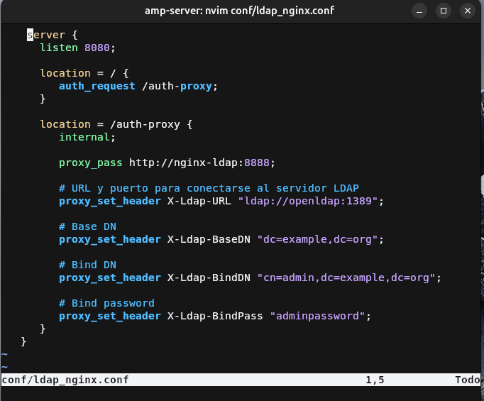

### Creación de los contenedores

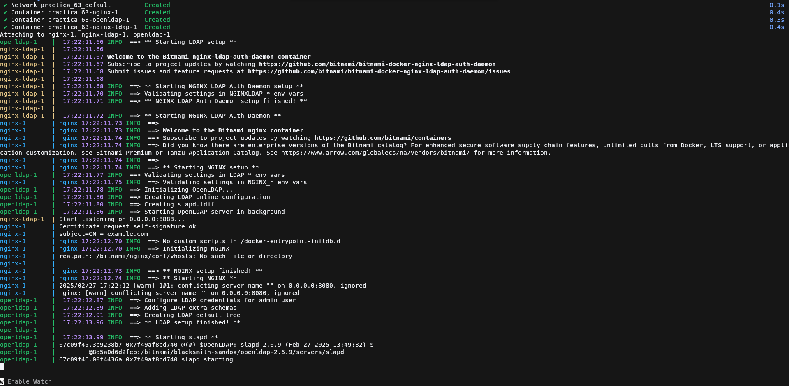

### Acceso a la web

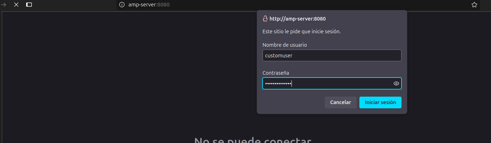

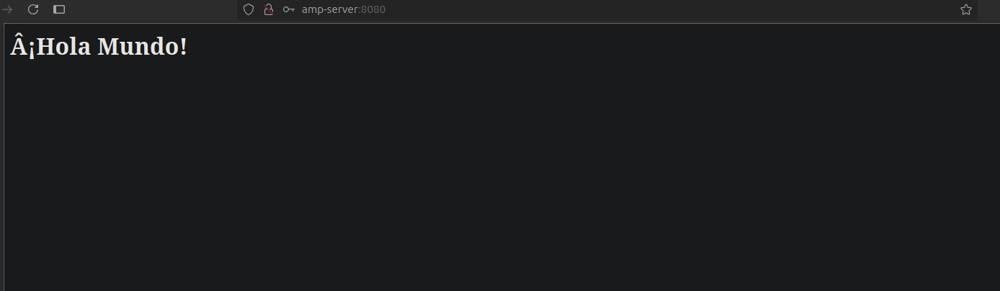

## Despliegue con Docker

### Preparar ficheros para los contenedores

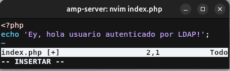

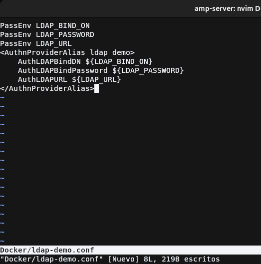

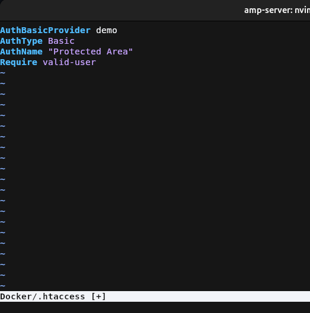

### Creación de la imagen
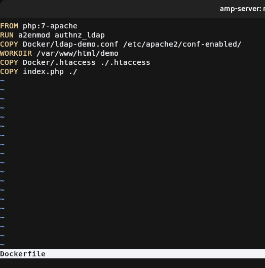

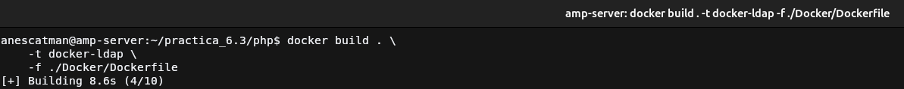

### Creación del contenedor

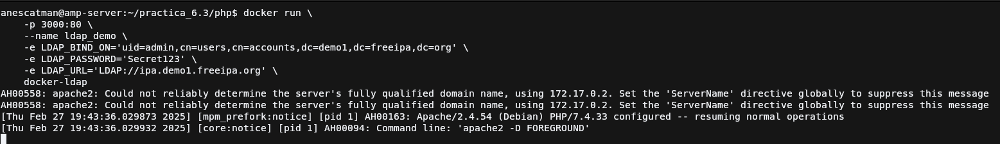

### Prueba de funcionamiento

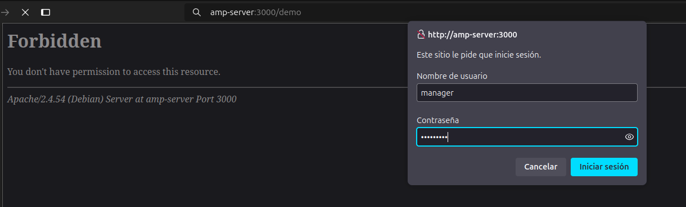

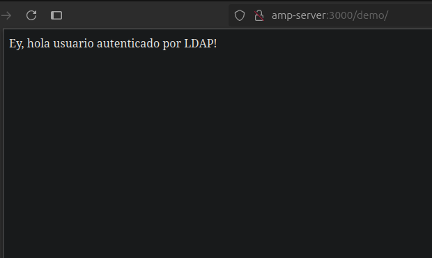
